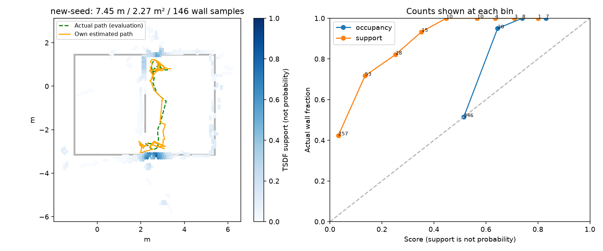
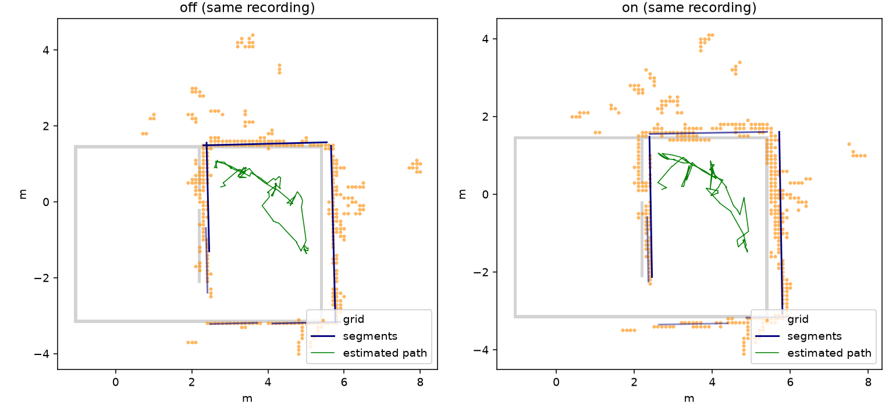

# egomap34 — 감독 승인 rotL DEV 1회 / 선분 지도 비교

2026-10-08 구현·결과 전 사전 등록. egomap33의 **5/7 미달은 그대로**다.
사용자/감독이 명시적으로 승인한 DEV 확인이며 기존 관문 통과에 따른 실행이 아니다.

## 새 물리 (한 번)

- 미사용 seed32002, 180 SIM초, egomap31 tape/SEARCH/강성real_v1/frontier_rbpf_v1/
  public_ros_v8/recovery/±20°/insertion/selective/Manhattan/switchable 구성 그대로,
  `motion_model=s2_pulse_v122_rotL_v1`만 변경. 선분 지도는 **물리 제어에 켜지 않는다**.
- agent_lock null 확인 후 단독 acquire→ugrp_session/dev_light→release. S2 점유 시 대기.
  freeze0, 모델0, 새 보정 측정0. source commit/push 후 고정, 실행 중 소스 변경0.
- 종료오차/σ/과신, yaw·경로 오차, 영역P/R·전체 덮임·벽RMSE, 칸/벽/프레임 표본수,
  이동/footprint 면적/hold, 삽입·거부 사유, B 자기 확인/GT도착·벽접촉을 기록한다.
  손목 RGB | 그 시각 자기 지도와 추정/실제 경로의4배속 영상. GT는 평가/그림만.
- 새 seed와 egomap31은 다른 궤적이므로 paired 개선 확증으로 합산하지 않는다.
  물리 예산30분/500MiB, ENOSPC·공간<10GiB는 HOST_ERROR. 실패 시 추가 실행0.

## 오프라인 선분 지도 (결과 전 고정)

`wall_map=segments_v1`, 기본off. 기존 격자/추정기/탐색은 변경하지 않는 별도 자기 지도 표현.
egomap31과 egomap33은 **같은 seed31001 녹화의 off/on 추정**임을 명시한다.
각각 기존 삽입47/50프레임만 사용하고, 동일 RGB의 기존 카메라/검출 열 접점을 재투영한다.
보간한 선분 점을 독립 측정으로 세지 않는다. 자기 pose/공분산과 관측 신뢰도만 사용한다.

- Nguyen et al. 2005의 split-and-merge 계열을 공개 BSD-3-Clause
  `kam3k/laser_line_extraction` commit `34de3e9d7560c04bec29e97f07339407c0bca6a6`와 대조한다.
  endpoint split→짧은/성긴 선분 제거→공분산 가중 선 적합→χ² 병합 순서.
  원본 기본값 split .05m, gap .4m, 최소길이 .5m, 최소9개 실제 열 표본,
  outlier .05m, χ²<3, 최적화 수렴1e-4를 고정한다.
  기존 카메라의 양의 깊이/최대4m, 최소range .4m(공개 기본)을 사용.
- 레이저 고정 잡음 대신 기존 카메라 1px 투영 Jacobian·영상 contrast/sharpness/settling으로
  점 공분산을 만든다. 자세 공분산은 프레임 공통항으로 선 공분산에 한 번 더한다.
  weighted orthogonal least squares는 동일 목적식을 SciPy로 계산(추가 의존성0).
- 여러 프레임 선 병합은 같은 χ²<3 및 관측 extent gap≤.4m. 상관된 자기 pose를 독립으로
  곱해 과신하지 않도록 표준 covariance intersection(고정 ω=.5)을 쓴다.
  Manhattan 기준축은 첫 자기 scan의4중 원형평균이며 GT축0°로 고정하지 않는다.
  가장 가까운90° 축으로 정렬하되 축/자세 불확실성을 보존한다.
  신뢰도는 공분산·서로 다른 프레임 수이며 점유 log-odds를 벽 확률로 부르지 않는다.
- 지도 정확도 평가는 기존 .15m 벽 허용거리·329개 GT벽 표본·잠재가시 정의 그대로.
  선분은 .05m 간격 길이표본 P와 같은 .1m 격자 raster P를 **둘 다** 기록한다.
  전체/가시R와 벽RMSE, 선분 개수·총길이·점/프레임 수를 같이 보고 분모 변경 착시를 막는다.
  기존 칸의 거짓점 중 벽거리>.15+.1√2/2인 비율도 계산한다: 이들은 셀 중심 양자화만으로
  설명할 수 없다. 격자 사용이 주원인이라는 것은 아직 가설이며 결과로 판단한다.

사용자의 '기준에 가까워지면'은 결과 전 다음처럼 적용한다: 두 추정조건 모두에서
선분 **전체 P·R·벽RMSE의 기존 목표(.90/.70/.15m)에 대한 양의 미달량이 비증가하고,
각 조건에서 하나 이상 감소**해야 내보내기 함수 구현에 착수한다.
이는 새 완화 합격선이 아니라 개발 착수 조건이다. 기존 egomap20 절대관문은 별도 그대로 보고,
미달 함수는 F 준비완료/LLM 투입 성공으로 보고하지 않는다. 비교는 raster P/R/RMSE로 판정하고
연속 선 표본값을 보조로 남긴다. 미달이면 원인만 기록, 문턱/옵션 사후변경0.

raw `/Users/changmin/projects/ugrp/outputs/wall-segment-dev-v1`, 기존 raw 보존.
기본off bytes 골든·관련1–3개 시험파일 통과 후 커밋·push. PR405 DRAFT/병합0.
TensorBoard 생략 유지, Drive0. 단계마다 supervisor 확인.

## 출처

- [Nguyen et al. 2005, IROS, DOI](https://doi.org/10.1109/IROS.2005.1545234): 비교 기준.
  세부 구현은 아래 공개 코드로 확인하며 이 논문의 수치를 우리 결과로 인용하지 않는다.
- [공개 구현·라이선스](https://github.com/kam3k/laser_line_extraction/tree/34de3e9d7560c04bec29e97f07339407c0bca6a6):
  `src/line_extraction.cpp` 21–55,150–244,246–355 및 `src/line.cpp` 155–244.
- [CI의 SLAM 적용, Julier & Uhlmann 2007](https://doi.org/10.1016/j.robot.2006.06.011):
  알려지지 않은 상관관계의 공분산 결합. ω=.5는 유효한 고정 convex weight이며 적합하지 않는다.
- Manhattan 축 계산은 기존 `harness/rbpf_manhattan.py:19–35`의4중 원형평균 재사용.

구현 연결: `harness.self_wall_memory_segments.SelfWallMemory(wall_map="segments_v1", ...)`의
`observe_wall(..., wall_points=contact_points(rgb, servo))`/`snapshot()`에서 사용할 수 있다.
기본off는 기존 memory에 위임하며, 이번 물리 실행기는 이 새 표현을 사용하지 않는다.
원본 C++ iterator의 끝점 누락은 Python inclusive corner split으로 옮겼고,
자세를 공유하는 프레임의 상관관계·카메라 잡음·extent gap 처리는
[이식 차이](../../third_party/wall_segments/NOTICE.md)에 명시했다.
문헌 DOI는 Crossref 제목 대조로 확인했다. Nguyen 원문 전문은 이 환경에서 열지 못했고
알고리즘 세부/수치는 공개 코드로 확인했다. 초기 단위시험의 NumPy 2D cross API 오류와
빈 관측 fixture 누락은 결과 개봉 전에 수정했으며, 이후 관련8시험 통과.

## 감독 승인 DEV 결과 — 기존 5/7 판정은 바뀌지 않음

사전 등록 `25258a88`, 실행 소스 **`9ff008331cd7c82ff94617e8dfc878cfdcb5d426`**.
agent_lock null에서 PID62932로 단독 획득, `egomap34-seed32002` 세션 종료/잠금 해제 확인.
180 SIM초/901 RGB를 완료했다(로컬 wall656.64초, 속도 비교 실험 아님).
모델0/freeze0/새 보정측정0/추가 물리0. 실행·오프라인 판정 뒤 옵션/문턱 변경0.

|지표|egomap31 seed31001 (기존)|egomap34 seed32002 (새 DEV)|
|---|---:|---:|
|종료XY / σXY / 과신 비율|0.2611m / 0.0689m / 3.787|**0.2020m / 0.1017m / 1.987**|
|경로XY RMSE / 2σ 초과|0.2313m / 112/891|0.2179m / 173/891|
|yaw 종료오차 / RMSE|−6.324° / 6.995°|1.481° / 6.946°|
|영역P (정확/평가 칸)|56.76% (42/74)|**63.58% (103/162)**|
|영역R (덮은/가시 표본)|52.10% (62/119)|**76.03% (111/146)**|
|잠재 가시 표본 / 전체 표본|119/329 (36.17%)|146/329 (44.38%)|
|전체P / 점유 칸|39.00% / 359|55.64% / 381|
|전체 덮임 / 벽RMSE|124/329=37.69% / 0.7599m|213/329=64.74% / **0.5204m**|
|이동거리 / footprint 면적|8.053m / 2.390m²|**7.449m / 2.2675m²**|
|hold / 제어프레임|40/891=4.49%|21/891=**2.36%**|
|B 자기 확인 / GT도착|절대73.3초 / 미도착|절대72.1초(경과70.8초) / **미도착**|
|벽접촉 / 거짓 문 경로 proxy|0 / 7|**0 / 3**|
|삽입 / 재표본 / loop수락|47 / 15 / 0|64 / 18 / 0|

위 자세/σ는 frontend 값이다. 두 실행 모두 loop수락0으로 completed graph와 frontend의
지도·경로 수치가 동일함을 별도로 확인했다. σ는 공분산 최대 XY 고유값의 제곱근이다.
종료점은 근소하게2σ 안이지만 전 경로173/891프레임에서2σ를 넘었다.
새 seed는 동일 입력 paired 비교가 아니므로 좌회전 이득의 일반적 개선 확증이 아니다.
기존 서술용 탐색 기준10개 중7개 통과(거짓문 proxy·영역P≥.7·벽RMSE≤.15 미달).
egomap33의 **5/7 미달을 통과로 바꾸지 않는다**. 전체 경기장 완주·B 도착 성공도 아니다.
벽접촉0은 저장된901회 평가 샘플의 abort-only 점검 기준이며 접촉 정보를 제어에 넣지 않았다.
영역은 실제 카메라/FOV/거리/벽 가림의 잠재 가시 영역(물체·자기 차체 가림 제외)이다.

|삽입 단계|새 DEV 개수|
|---|---:|
|RGB / 초기 대기 / 제어프레임|901 / 10 / 891|
|벽 geometry 있음 / 없음|878 / 13|
|중복 / 정착 / 거리 segment 거부|0 / 0 / 0|
|이동 관문 보류 / 통과|814 / 64|
|삽입 / bootstrap / 정합수락|64 / 1 / 30|
|명시 거부 후 삽입|28 (low_overlap7 / high_residual19 / search_boundary2)|
|점 부족 정합 미시도 후 삽입|5|
|거부 때 가중치 갱신 / 재표본|0 / 0|

egomap26 삽입 수정은 켜져 있고 관문 통과64/64를 삽입했다.
[삽입 전체 계수](results/physical-insertion.json), [원 지표](results/new-seed.json),
[frontend·기존 비교](results/comparison.json).

[4배속 미리보기](figures/wrist-map-4x-preview.mp4) / 원본
`/Users/changmin/projects/ugrp/outputs/wall-segment-dev-v1/wrist-map-4x.mp4`.
901프레임·20fps·45.05초, 매 시각 이전 online snapshot만 사용한다(마지막 지도를 과거에 채우지 않음).
원본1280×480의 처음/중간/마지막 화면과 전체 디코드 확인. 오른쪽 회색 벽·초록 실제 경로는
평가용 도식이며 로봇 관측이 아니다. [영상 해시](results/video.json).

## 선분 지도 결과 — 두 조건 모두 착수 기준 미달, export 보류

여기서 off/on은 **동일 egomap31 녹화의 v122/rotL 추정**(egomap33)이다.
위 새 seed32002 물리와 합산하지 않는다. 예측을 먼저 봉인한 뒤 GT로 평가했다.

|추정 / 표현|전체P|전체R=덮임|벽RMSE|평가 칸/점 수|
|---|---:|---:|---:|---:|
|v122 격자|39.00%|37.69%|0.7599m|359칸|
|v122 선분→동일10cm 격자|41.14%|18.84%|0.2032m|158칸|
|v122 연속선 .05m 표본|41.51%|20.67%|0.1992m|318점|
|rotL 격자|32.83%|43.47%|0.6584m|399칸|
|rotL 선분→동일10cm 격자|42.07%|18.84%|0.2317m|164칸|
|rotL 연속선 .05m 표본|36.39%|17.33%|0.2286m|327점|

|추정 / 표현|영역P (정확/평가)|영역R (덮은/잠재가시)|
|---|---:|---:|
|v122 격자|56.76% (42/74)|52.10% (62/119)|
|v122 선분 raster|4.65% (2/43)|25.21% (30/119)|
|v122 연속선|8.60% (8/93)|28.57% (34/119)|
|rotL 격자|52.86% (37/70)|51.26% (61/119)|
|rotL 선분 raster|25.49% (13/51)|15.97% (19/119)|
|rotL 연속선|39.83% (47/118)|21.01% (25/119)|

같은 격자에서도 P·RMSE 개선과 R 악화가 동시에 생겼다. 영역P는 벽 뒤로 밀린 점이
잠재가시 분모에서 빠지는 기존 정의 때문에 전체P와 크게 다르며, 유리한 분모만 골라 보고하지 않는다.
실제 이동8.053m/footprint2.390m²와 전체329개 벽 표본은 두 추정에서 공통이다.

v122는47 삽입프레임/3,054 실제 열 접점→39 추출선→6 누적선(15.454m),
rotL은50프레임/3,247 접점→30 추출선→6 누적선(15.810m)이었다.
격자 거짓셀 중 GT벽과 .22071m(허용.15+반대각선.07071)보다 먼 것은
**185/219=84.47%, 206/268=76.87%**다. 그 셀은 중심 반올림만으로는 설명되지 않는다.
격자를 거치지 않은 실제 접점도 전체P51.28/64.18%, 벽RMSE.3758/.3226m였다.
따라서 '칸 단위 점유만이 남은 오차의 원인'이라는 가설은 지지되지 않는다.
프레임 자세/투영의 잔차와 짧고 성긴 관측 제거·선 병합/축 정렬에 따른 범위 손실이 남는다.
각 원인의 기여를 독립적으로 분리한 것은 아니며 이번에는 재튜닝/추가 ablation을 하지 않았다.
공분산은 해당 시각 frontend 입자 퍼짐과1px 영상 오차 모델의 근사치이며 최종 선택 입자 조상의
정확한 사후 공분산이 아니다. 서로 인접한 영상 열의 오차 독립성도 보장하지 않는다.
Manhattan 축은 최소 길이/점 수 필터를 통과한 선이 처음 나오는 자기 scan에서 정했다.
따라서 CI를 사용했다는 사실만으로 신뢰도가 실제 정답률에 보정됐다고 해석하지 않는다.

기존 절대관문 P≥.90/R≥.70/벽RMSE≤.15는 각 조건 **0/3**이다.
사전 등록한 미달량 비증가 조건도 R 악화로 **0/2**다.
`wall_export=segments_confidence_v1`은 **미구현/보류**, 모듈F 완료를 주장하지 않는다.
[전체 수치](results/segments.json), 원시 점/공분산·선분은 로컬 `segment-predictions/`에 보존했다.

## 검증·보존

관련3파일 **8시험 통과**, off memory snapshot bytes 동일, 회전 옵션의 기존 시험 포함.
원본 공개 코드/라이선스 bytes 그대로 보존(원본 trailing whitespace 포함), 새 venv/의존성0.
실행 소스32파일 해시·raw 전체·미추적 사용자4파일 불변과 결과/영상 해시를 검증했다.
[검증 기록](results/verification.json), [raw manifest](results/raw-manifest.json).
Git에는 코드·표·작은 그림/미리보기만 저장했고 raw 로컬 보존을 원격 백업으로 표현하지 않는다.
PR405 DRAFT 유지, 병합0. 이번에는 #406 코드·파일 변경0.
