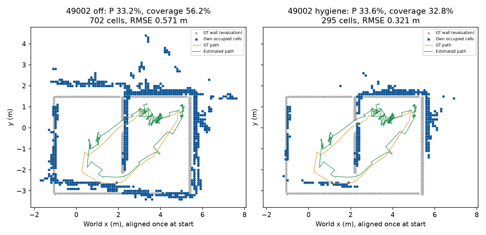

# egomap55 — 목표 지향 RouteMap P0 (물리 0)

## 사용자 목표 변경과 범위

2026-10-09 사용자 결정에 따라 [설계서](../../docs/selfmap-gtr-research-20261009.md) §3.2/3.4/3.5/3.8/3.9를 따른다. 강제 `unknown_start_reset`은 주 흐름에서 제거할 예정이며 별도 강건성 조건으로만 보존한다. P0와 확인된 버그 3건만 이번 구현 범위다. 연속 추적→자기 상자/B 확인 후 접근→실제 도달 확인→시작↔상자↔B 경로 저장이 P1의 방향이다. **P1 구현/물리 승인으로 해석하지 않는다.** 벽 검출기는 eg34 동결, 설계 §1.3 방식 재시도0, 단서 제거0, 모델 호출0, 새 물리0. GT는 봉인된 예측을 평가하거나 P0-4 합성 센서만 생성하며 추정 함수 입력에는 넣지 않는다.

## 실행 전 고정한 P0 판정

| 항목 | 자료/분모 | 고정 판정 |
|---|---|---|
| P0-1 | 설계 §3.7 경기장 표 | door_geometry/two_doors/corridor와 s1–s8 대응은 설계 그대로 |
| P0-2 | ownmaps2a의 동일 S2 7기록, 기준 PF+two_doors_final_v3 정적 지도 | stdXY≤.05m 최초 선언에서 평가 XY≤.25m·yaw≤15°를 정상으로 센다. 정상 n≤4/7이면 같은 경기장 재구축 필수, n≥6/7이면 불일치 주원인 아님,5/7은 미결정. 진단이며 합격률 아님. 기존 기준7/7 병기 |
| P0-3 | eg49 seed49001–49006 모두, 중단2개 포함 | 경기장 밖≥.5m 점유0,40cm 벽 커버 감소≤5%p,영역P 비감소,경로튜브 내GT unknown0,시작free6/6. 전체 벽 분모와관측거리≤2.5m 분모를 함께. 분모 축소를 개선으로 세지 않음 |
| P0-4 | s1045–1047의 평가 카메라/GT 차체 로그 + 정적 지도→기존 초음파 모델 합성 판독 | 정면평벽/거리≥1m/입사±20°인 자기 관측만 추정에 사용. 자세별 pitch 오프셋 복원 절대오차≤.27°. 프레임수/유효수/제외사유·시퀀스별 오차 보고. 합성 판독은 실측 센서 증거가 아님 |
| P0-5 | eg52 재방문3698시도(복구41은별도) | 기존 CSM 수락 불변+자기 색전이 순서 일치 게이트. 수락 상대XY오차 감소/거짓수락0. 거짓은 기존국소화 허용(.25m,15°) 밖. 수락0이면 정합 성능 성공 아님. 분모/결측·단서부족 모두 보고 |

새 기능은 별도 `route_hygiene=observed_support_v1`, `pitch_bias=ultrasonic_v1`, `place_gate=color_sequence_v1`, 기본off. off는 입력을 그대로 반환해 기존출력bytes유지. 합성 판독/평가기를 제어경로에 연결하지 않는다. 히스토리나 GT로 관문값 재적합0. 프로그램 오류 수정과 결과 튜닝을 구분한다.

지도 위생: 기존 inverse sensor hit/miss·clamping 및 거리 오차 전파 재사용, **끝점 점유는≤2.5m**,더 먼 반환은2.5m까지 free-ray만(OctoMap maxrange 규칙). 같은 cell은 서로 다른 기존 teach keyframe 2개 이상 지지가 있어야 occupied. 기존 d² 거리 표준편차(픽셀→바닥 Jacobian)의 제곱이 분산임을 구분한다. 시작/지나간 footprint는 free, 관측범위 밖은 unknown. 평가 경계로 자르거나 GT 벽에 snap하지 않는다. 이 규칙의 남은 outlier도 그대로 보고한다.

색전이는 기존 색 검출 hue 어휘만 사용한다. 연속 중복색은 압축하고 각 노드 이전의 최근3개 서로 이어진 색 단어를 같은 진행 방향 또는 명시적 역방향으로 비교한다. 단일색/3개 미만은 정보부족으로 거부한다. 이3개는 설계의 시퀀스 구현 선택이며 논문 상수라고 주장하지 않는다. CSM 거부를 색만으로 수락하지 않는다. 기본 CSM 캐시/검색창/점수는 불변.

## P1-b 사전등록 — 실행 승인 대기

같은 경기장 `zone_wide_door_geometry_v3`, 연속 추적·강제loss0. T1 55001–55003: (3.25,.75,π), T2 55004/55005: (−.898,−2.25,0),55006/55007:(−.898,−.85,0),55008/55009:(−.898,.55,0). 설계의x=−.898을 사용(기존 spawn 원값−.8982의 표기반올림 차이. yaw0는 v96표준spawn 원값). 초기자세는 설정에만, 제어에GT전달0. `seed-audit.json`은main+열린11PR에서미사용확인. 각1회,대체/반복0,ENOSPC=HOST_ERROR,새물리실행은감독확인후.

| §3.9 관문 그대로 | 값 |
|---|---|
| T1 B도착 / T2 B도착 |3/3 / ≥5/6 |
| 거짓선언 / 벽·로봇접촉episode 합계 |0 / ≤1(9회) |
| 시작→B,상자경유각구간 SIM시간 |≤270초(늘리지않음) |
| 지도경로/평가GT최단경로 |≤2.0 |
| ±1m경로튜브 안벽커버≤.15m / 점유P / 벽RMSE |≥.70 / ≥.70 / ≤.20m |
| 경기장밖≥.5m outlier / 단서장부 |0 / 9회모두≥1개 |

T1쉬운조건과T2문통과를합산해성공률을부풀리지않는다. 전체분모/영역분모·미실행·제외사유를함께보고. 기존전체지도품질 P≥.90/R≥.70/RMSE≤.15m는별도표유지. P0-4 통과시 P1-a 정차보정≤60SIM초를 제안할 수 있으나 이번 실행0. P1-b는 등록만,실행 승인 대기다.

## 표준 출처/재사용

- VT&R3 Apache-2.0 [원본](https://github.com/utiasASRL/vtr3), 정확한 keyframe/temporal/정합실패zero-command 줄은 [eg53](../2026-10-09-teach-capture/README.md). 기존 CSM/cache를 재사용하며 거리만으로 지름길을 만들지 않는다.
- [OctoMap OccupancyOcTreeBase](https://octomap.github.io/octomap/doc/classoctomap_1_1OccupancyOcTreeBase.html): maxrange ray/free와hit/miss/clamping. 평면 0.1m 기존격자를 유지한다. Thrun 2005 ch9 역센서 및 기존 `wall_confidence.confidence`의 거리 Jacobian을 재사용한다.
- 색시퀀스는 설계§3.4/3.8의 단서게이트로 새로 구현하며 SeqSLAM 완전이식이라 부르지 않는다. OpenSLAM SeqSLAM 페이지는이번조회실패,확인안된수치인용0.
- `ownmap_s2.GridField`의 20,000,000 fine cell 예산(원본148–163행), 현재로컬samePF/카메라/모델을읽기전용재사용. 다른worktree쓰기0.

## 버그/검증

선언terminal화(선언후6프레임),할당전raster예산,복원negative log-odds의snapshot ray provenance유지. RGB바닥직접관측을조작하지않는다. 기존`public_navigation_raytrace`도free ray를floor_frames provenance로썼으므로같은의미로복원한다. 변경2시험파일14통과;새옵션은추가시험후별도기록. CI대기0/PR405 DRAFT 유지.

## 결과

사전등록 시 P0-2~5 미실행. 결과 후 문턱 수정0. raw `outputs/goal-route-p0-v1/`.

### 17:2x 감독 추가 사전등록 — 누적 가상 스캔

`scan_accumulation=keyframe_submap_v1`,기본off. eg49 6개+eg34 seed32002를각각비교한다. 기존RBPF의정합/재표본/삽입시점관문은그대로,그사이에gmapping_motion_gate로스킵된자기벽접점을명령DR상대변환으로버퍼에모은다. 다음기존삽입시점의자기추정pose로옮겨regional submap에한묶음삽입한다. 불일치거부프레임/미정착/4m밖은기존처럼제외하고마지막미flush버퍼는미삽입으로보고. 이는고정기록의지도갱신진단으로,변경지도가후속RBPF정합에미치는폐루프효과는이번결과가증명하지않는다. 단순매프레임삽입eg44와구분한다. 보고:기존삽입keyframe수/실제반영관측frame수/버퍼미반영수,벽커버·점유P·RMSE. 기존P0-3위생과누적단독을분리하고결과후문턱수정0. Cartographer의local submap내연속range data누적구조를따르며GMapping이카메라스캔버퍼를원래지원한다고주장하지않는다.

P0-2는최초내부수렴선언때정지(수렴안하면기록끝),선택규칙에GT사용0. 기준same-map의최초선언까지원본7필드byte동일을확인하고다른지도조건을실행한다. P0-4는카메라명령/보정+자기접점+합성거리만입력,원뿔plane echo역산과pitch±5°root solve(결과전에고정). 실제카메라pitch는오차채점에만사용한다.

누적 삽입은 Cartographer ProbabilityGrid처럼 한 셀당 한 키프레임 묶음에서 strongest hit/miss 한 번(hit 우선)만 반영한다. 각 관측의 ray 원점은 개별 DR로 deskew하며 기존 키프레임의 frozen insertion_weights는 그대로 쓴다. 추가 관측은 기존 confidence와 저장된 자기 covariance를 사용한다. 옵션 모듈 시험6개 통과(off객체/bytes 동일,시퀀스,범위/2노드/swept-free,누적중복 방지,pitch 양·음 부호).

P0-2 초기 다른지도 constructor는 원본 S2의 door_1 작업경로 admission 때문에 프레임0에서 거부됐다. 추정 관문 실패가 아니다. 사용하지 않는 task route만 원본 정적 지도에서 가져오고, PF/likelihood/landmark의 입력은 다른 지도 전체로 유지했다. control/drive는 원본 어댑터의 금지 함수 그대로다. 두 지도 실제 constructor 시험2개 통과. 경기장 ID alias는 보정 admission만 위한 것으로 실제 map_id/hash를 예측 receipt에 따로 남긴다.

P0 지도평가의 영역은 평가 GT 경로±1m이며 전체 P/R도 항상 병기한다. 2.5m/4m 분모는 기존 in_view의 실제 카메라 FOV·벽 가림 기반 potential visibility(물체 가림 미모델링). pitch는 자기 서보 명령 자세별로 유효 range-plane root의 인과적 중앙값을 유지하며, 각 자세의 최종값과 같은 표본의 평가 실제 편향 중앙값을 비교한다(±.27° 불변). 단일프레임·인과적 오차분포도 함께 보고한다. 초음파 합성 난수seed=55000+S2기록번호,기존노이즈/드롭아웃/양자화 그대로.

P0-4 첫 계산에서 지평선 양쪽으로 ±5° 구간을 잡으면 upward 끝점의 나눗셈이 NaN이 되어 내부의 유효 root까지 거부하는 수치버그를 발견했다. 범위·조건은 유지하고 분모를 곱한 연속 평면 방정식으로 풀고, 얻은 해의 양의 깊이를 확인한다. 2m/3.8m·±.87° 합성 단위시험으로 회귀 고정. 첫 결과(1/3,유효7개)는 `results/pitch.json`/raw `pitch/`에 보존하고 버그수정 재계산은 `pitch-solver-fix/`로 분리. 결과로 threshold 재적합0.

## P0 결과 (물리0,모델0,재튜닝0)

설계/버그/사전등록 `239216bf`, 옵션 동결 `80bc4f22`, 재생기 `d9ec34d2`, pitch 수치버그 수정 `6e75104e`. 원시 예측/입력 해시는 `/Users/changmin/projects/ugrp/outputs/goal-route-p0-v1/`에, 채점은 `results/`에 저장했다. 다른 worktree 수정0.

### P0-2 다른 경기장 대조군

같은 기준 PF(읽기 전용 ownmap-s2 `191cd213f2f522ddd5468cdaeb34ff6694714957`)와 기록된 RGB/명령만 재생. 기준 최초수렴까지7필드 bytes 동일 **7/7**, 다른 지도 최초정상수렴 **7/7**(제외0,GT누락0). 사전 규칙 n≥6에 따라 **경기장 불일치는 이 최초수렴 실패의 주원인이 아님**. 전체 경로 추적/다른 경기장 주행 성공을 뜻하지 않는다. 공통외벽/색구역이있는초기수렴진단이라다른지도일반허용근거가아니다. v139/v140 s1060의 동일 초기구간은 독립 표본으로 해석하지 않는다.

|S2 기록|기준 최초t / XY / yaw|다른 지도 최초t / XY / yaw|정상(기준/다른)|
|---|---|---|---|
|v139-s1059|12.10s / 0.046m / 0.73°|12.15s / 0.045m / 0.81°|1/1|
|v139-s1060|91.95s / 0.158m / 4.33°|18.90s / 0.101m / 1.24°|1/1|
|v139-s1061|13.95s / 0.031m / 2.18°|32.95s / 0.026m / 0.69°|1/1|
|v140-s1060|91.95s / 0.158m / 4.33°|18.90s / 0.101m / 1.24°|1/1|
|v140-s1062|21.55s / 0.026m / 2.39°|25.75s / 0.033m / 3.63°|1/1|
|v140-s1063|82.85s / 0.172m / 0.98°|89.95s / 0.182m / 1.05°|1/1|
|v140-s1064|11.15s / 0.005m / 2.64°|12.30s / 0.005m / 2.55°|1/1|

다른 정적 지도 전체(벽·색구역·문)를 PF에 전달했다. 원본 `zone_solo_cyan_likelihood_field.py:81–82,164–165`의 Field(static),`zone_solo_cyan_landmarks.py:209,267–275`의 MapFeatures(static)가 그 입력을 사용함을 확인. 원본 task route는 constructor 충족용으로만 보존하며 control/drive는 호출 금지. 원본 파일/카메라/모션/난수·AMCL 설정 변경0.

### P0-3 지도 위생 — 6/6 재생, 관문0/6

실패·짧은 기록도 제외0. eg49의49003/4는 탐색 중 벽접촉 조기종료,49005/6은 탐색 후 귀환 벽접촉이다. P0는 저장된 **탐색 prefix**만 사용하며 귀환 GT나 미래 관측을 넣지 않는다. 최초 등록의 “중단2개”는 짧은 탐색2개를 뜻하며 총 물리실패는4/6이다.

P/R 영역 정의를 섞지 않는다: 아래 영역P/R은 eg34와 동일한 **4m FOV 잠재가시 영역**(벽가림만 모델링), 전체P/덮음도 병기. 추가 경로튜브±1m P/R은 `map-*.json`의 area_*이며 가시영역P 대체값이 아니다. 두 정의로 비감소를 검사해도 같은4/6이다.

|seed(탐색 관측/삽입)|전체P off→위생|전체 덮음 off→위생|점유칸 off→위생|RMSE m off→위생|영역P/R off→위생(영역칸)|
|---|---|---|---|---|---|
|49001 (1790/220)|37.3%→50.3%|71.1%→52.0%|723→352|0.490→0.260|55.8%/61.1%→53.2%/45.7% (283→216)|
|49002 (1790/155)|33.2%→33.6%|56.2%→32.8%|702→295|0.571→0.321|55.2%/62.3%→52.1%/27.4% (230→117)|
|49003 (169/15)|55.5%→80.6%|40.4%→15.2%|173→31|0.382→0.148|63.0%/48.1%→66.7%/15.7% (54→9)|
|49004 (389/24)|59.6%→89.5%|46.5%→28.9%|193→57|0.554→0.106|82.1%/57.8%→100.0%/29.4% (56→9)|
|49005 (1790/199)|52.4%→88.3%|83.9%→51.1%|687→197|0.540→0.264|90.2%/80.2%→99.2%/48.8% (204→124)|
|49006 (1790/157)|61.1%→82.4%|81.5%→72.9%|728→357|0.543→0.203|85.8%/81.7%→88.8%/69.7% (219→187)|

|seed|전체 벽 분모 / 2.5m 가시분모|2.5m분모R off→위생|40cm 전체벽커버 off→위생|경계밖≥.5m칸 off→위생|GT튜브 unknown off→위생 / 분모|시작free|
|---|---|---|---|---|---|---|
|49001|329 / 123|77.2%→65.0%|99.7%→80.5%|109→17|2→0 / 1800|True→True|
|49002|329 / 150|58.7%→32.0%|90.6%→65.0%|166→22|19→24 / 1800|True→True|
|49003|329 / 50|82.0%→34.0%|55.3%→33.7%|12→0|6→0 / 179|True→True|
|49004|329 / 49|100.0%→61.2%|58.4%→40.7%|19→0|0→0 / 399|True→True|
|49005|329 / 130|89.2%→64.6%|99.7%→58.7%|112→12|0→0 / 1800|True→True|
|49006|329 / 140|87.9%→86.4%|100.0%→85.1%|81→7|0→0 / 1800|True→True|

경계밖0 **2/6**,40cm커버 손실≤5%p **0/6**,영역P 비감소 **4/6**,GT튜브unknown0 **5/6**,자기출발점free **6/6**. 경계밖 칸 합계499→58. 관문0/6으로 미채택. **서로 다른 노드의 지지는 반복되는 자세/투영 편향을 제거하지 못하며, 제거한 벽의 덮임 손실이 크다.** GT 경계로 자르지 않았고 분모축소를 개선으로 세지 않았다. 시작free는 자기원점(0,0) 검사이며 다른 S2 시작위치의 free 여부와 별개다.

### 감독 추가: 누적 가상 스캔 단독

기존 키프레임 수/정합 관문 불변, 버퍼의 실제 반영관측만 늘었다. 아래는 위생과 **합치지 않은** 조건.

|seed|삽입keyframe(불변) / 관측|반영frame off→누적 / 미flush|전체P off→누적|전체덮음 off→누적|점유칸 off→누적|RMSE m off→누적|영역P/R off→누적|
|---|---|---|---|---|---|---|---|
|49001|220 / 1790|220→1777 / 3|37.3%→28.4%|71.1%→80.5%|723→1278|0.490→0.671|55.8%/61.1%→58.2%/72.6%|
|49002|155 / 1790|155→1780 / 1|33.2%→27.5%|56.2%→67.2%|702→1464|0.571→0.890|55.2%/62.3%→55.3%/76.6%|
|49003|15 / 169|15→147 / 22|55.5%→40.8%|40.4%→50.8%|173→343|0.382→0.748|63.0%/48.1%→48.9%/70.4%|
|49004|24 / 389|24→346 / 41|59.6%→45.2%|46.5%→58.1%|193→420|0.554→0.831|82.1%/57.8%→80.4%/78.4%|
|49005|199 / 1790|199→1753 / 29|52.4%→31.8%|83.9%→87.2%|687→1338|0.540→0.793|90.2%/80.2%→89.9%/84.3%|
|49006|157 / 1790|157→1780 / 1|61.1%→37.9%|81.5%→84.8%|728→1556|0.543→0.955|85.8%/81.7%→88.0%/85.7%|
|32002|64 / 891|64→876 / 2|55.6%→37.0%|64.7%→74.2%|381→1041|0.520→0.780|63.6%/76.0%→54.4%/80.8%|

seed32002 기준의 eg34 영역P/R **63.6/76.0%**,전체덮음64.7%,381칸을 정확히 재현했다. 누적은반영64→876/878,정합/키프레임64불변,영역P54.4%/R80.8%,전체덮음74.2%/1,041칸. 전체RMSE .520→.780m: **기록 누락은 줄었지만 오도메트리 deskew 편향도 확산**. P0-3 관문 통과나 위치추정 개선으로 보고하지 않고 미채택. 누적 끝점은키프레임으로변환하지만 각프레임의 ray원점은보존. 기존keyframe weights 그대로, 추가frame은같은모델을사용한다. 각기록 `gate_counts`와반영id는rawreceipt에 있다. seed32002 원시관측은891개이고검출0인13프레임을제외한결정원장은878개이므로표의전체관측분모와반영가능분모를구분한다.

### P0-4 초음파 pitch 합성 가능성

수치버그 수정본만 최종 판정: **3/3 SEARCH 시퀀스**,유효664/25,395프레임(24,731 조건/관측 제외),자세별오차≤.27°. 다른 팔자세는 유효표본0으로 미검증이다. 독립664회 실험이 아니며 각기록의 연속·상관 관측이다.

|자료|유효/전체|추정편향 / 실제편향(°)|절대오차(°)|인과적오차중앙 / P95(°)|통과|
|---|---|---|---|---|---|
|s1045|310/13794|-0.967 / -0.847|0.119|0.145 / 0.421|True|
|s1046|169/6500|-1.001 / -0.873|0.129|0.116 / 0.352|True|
|s1047|185/5101|-0.995 / -0.867|0.129|0.113 / 0.317|True|

기존초음파 모델의거리잡음/드롭아웃/양자화·정적벽/문기둥을그대로합성했다. 동적상자·로봇에코,차체roll/pitch와마운트높이오차는미모델링이므로실제보정성공이아니다. 에코/카메라가같은벽을보고있다는가정의한계가남는다. 제외:자기접점없음24,577,센서전면축접점없음95,비스듬함40,무효판독17,1m미만2. 조기 인과적P95는.317–.421°로최종중앙값보다크며 즉시정확한온라인보정을입증하지않는다. 최초NaN출력직렬화는센서`as_dict()`로고쳤고,지평선나눗셈버그전1/3결과도보존했다. **P1-a SEARCH 정차보정≤60SIM초 제안 가능**,이번물리0.

### P0-5 색전이 시퀀스 추가 게이트

|종류|시도 분모|수락 off→on|거짓수락 off→on|수락 XY오차 중앙(m) off→on|판정|
|---|---|---|---|---|---|
|place_recognition|3698|32→1|18→1|0.343→0.564|미달|
|recovery_bridge|41|2→2|0→0|0.043→0.043|별도·불변|

기존34수락 전체 중앙 .312m는복구2건포함값이며,재방문32건만의기준은.343m다. 3,698중 원CSM거부3,666은그대로,색불일치31추가거부,수락1개(거짓1개). 복구41은합산0. 색전이의순서일치만으로반복색/오연관을배제하지못해 **미채택**,문턱수정0. 제어기에GT색위치나정답정합을넣지않았다.

### 실행 범위·P1 결정

P0-1 경기장/시나리오표는동봉설계§3.7그대로,추가장면변경0. 버그3건(선언후6프레임hold·raster예산·free출처복원)수정완료. 변경3시험파일 **23통과**,off지도7건bytes동일/기준PF7건prefix bytes동일. P0실험으로기존옵션기본값변경0. egomap54 사용자취소1건은결과분모제외,미실행3건,유효결과0(eg53 HOST_ERROR2와별도).

**P1-b: 55001–55009(T1 3/T2 6)등록·push만 완료,실행0/9.** P0-4에따른P1-a를추천할수있지만지도위생0/6·색게이트미달이라새옵션을성공한구성으로채택하지않는다. P1-b 연속추적/최소RouteMap 주흐름은이번P0범위에서아직구현하지않았으며감독확인후별도구현·실행해야한다. 강제loss는기존강건성코드로보존하고새주흐름엔사용하지않는다.

### 추가 확인한 원문

- [Cartographer local_trajectory_builder_2d.cc](https://github.com/cartographer-project/cartographer/blob/master/cartographer/mapping/internal/2d/local_trajectory_builder_2d.cc#L125-L185):시각별pose extrapolation과range accumulation.원본은나중에motion filter도적용하므로“원본이모든관측을무조건삽입”한다고해석하지않는다.
- [ProbabilityGrid range inserter](https://github.com/cartographer-project/cartographer/blob/master/cartographer/mapping/2d/probability_grid_range_data_inserter_2d.cc#L47-L86),[Insert/FinishUpdate](https://github.com/cartographer-project/cartographer/blob/master/cartographer/mapping/2d/probability_grid_range_data_inserter_2d.cc#L113-L121):hit우선·동일update에서중복증분금지. Apache-2.0. C++코드복사없이기존Python역센서모델을재사용.카메라단안의각관측원점보존/기존confidence 최대가중치는우리어댑터차이로명시.
- 초음파: `harness/ultrasonic_model.py:158–177,191–265`, `harness/ultrasonic_map.py:108–139`의원뿔/firstecho,시뮬과동일읽기모델;추정은ray-plane 방정식의단일pitch root.

재현(물리/모델호출없음): `code/pf_counterfactual.py`, `map_replay.py predict/evaluate`, `sequence_replay.py predict/evaluate`, `pitch_replay.py generate/predict/evaluate`, `pf_evaluate.py`, `visibility_audit.py`. 기존raw를덮어쓰지않게예측디렉터리는이미결과가있으면거부한다. 모든결과후문턱재설정0,PR405 DRAFT,CI대기0,TensorBoard생략요청유지.
