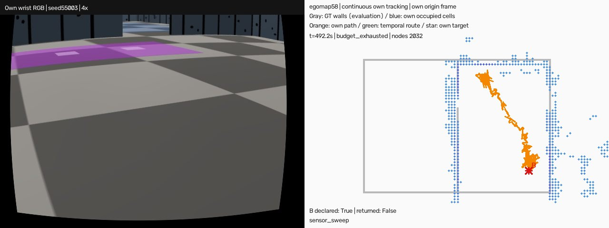
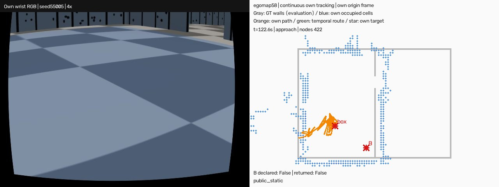

# egomap58 — P1 지도 원천 자산·물리 전 검사·HOST 차단

2026-10-09 사용자 승인. egomap57의 55001–55009는 전부 초기화 HOST_ERROR이며 RGB 0·유효 물리 과제 0이다. **이번 사용자 결정에 따라 이전 묶음은 ‘실행 오류, 결과 아님’으로 분리한다.** 이전 raw/결과/분모 기록은 수정·삭제하지 않는다. 성공/실패 성능 0/9로 해석하지 않는다. 같은 사전등록 seed를 이번 수정 실행에서 각1회 다시 실행한다.

## 실행 전 등록 — 조건·문턱 불변

[egomap56/57 사전등록](../2026-10-09-goal-route-continuous/README.md)의 acf9cc7e와 [P0/P1 설계](../../docs/selfmap-gtr-research-20261009.md)를 그대로 유지한다. T1 55001–55003(동쪽 시작), T2 55004–55009(서쪽 세 행, 각2회), 총9회. 장면 zone_wide_door_geometry_v3, SEARCH·tape_v1·real_v1·rotL·RBPF100·eg27 wide·switchable·공통 v145 heading factory·eg48 결과동일 가속, pitch/hygiene/accumulation/color gate off. 카메라/검출기/물리계수/모션/지도/제어기/예산 변경0. tape_v1 패턴 생성 규칙·seed16001·물리 스케일도 동일하며, 장면과 맞지 않던 자산 기하만 올바른 원천에서 생성한다.

| 판정 | 고정 값 |
|---|---|
| B 도착 선언 + 평가 GT 중심 B 내부 | T1 3/3, T2 ≥5/6 |
| 거짓 선언 / 벽·로봇 접촉 episode | 0 / 총9회 합계≤1 |
| 첫 목표·다음 목표·시작 귀환 | 각각270 SIM초, 최대810초; HOST60분/회 |
| 실제 지나온 시간 엣지 경로 / GT 최단(평가만) | ≤2.0; 귀환 shortcut 0 |
| 실제 경로±1m 벽 표본 커버 / 점유P / RMSE | ≥.70 / ≥.70 / ≤.20m |
| 경기장 밖≥.5m 점유 / 단서 장부 | 0 / 실행마다≥1 |

첫 확인시 즉시 접근, 자기 현재 RGB로 도달 확인, 연속추적·강제loss0, 지나온 경로로만 귀환한다. GT는 채점만. 매 실행의 시작/목표/귀환 구간별 자기·GT 경로 길이, SIM초,270초 예산 실패를 아래에 즉시 기록한다. 새 HOST_ERROR와 미실행도 모두 숨기지 않는다. 동일 HOST_ERROR 연속2회면 남은 회차를 실행하지 않고 NOT_RUN(차단)으로 기록한다. 재튜닝·임의 seed 교체·추가 재시도0.

순서: **S3의 새 s3fix 스모크 terminal 확인 + 잠금 반환** → 공유 agent_lock → 한 번에 하나. 이전 v146 종료는 이번 입장 근거가 아니다. dev_light·nice0·ugrp_session 사용, 다른 작업 프로세스 종료0,CI 대기0. 예상 총1.5–6시간+선행 대기(실측 아님),HOST 최악9시간. ENOSPC는 HOST_ERROR,10GiB 미만 시작 금지.

## 수정 범위와 원천

| 옵션 | 기본 | 이번 |
|---|---|---|
| wall_assets | off(기존 scene 함수/출력 그대로) | map_definition_v1 |
| tape pattern | 기존 | tape_v1 그대로 |
| HOST 차단 | 기존 실행기 불변 | 새 유한 cohort 실행기: type+message가 동일한 HOST_ERROR 연속2회 |

원인은 old two-door용 `tape_v1` divider_1 길이1.925m와 P1 single-door 물리 길이2.950m 불일치였다. `sim.zone_masterpi_v3_scene.static_map`의 등록·해시 검증된 지도 → 실제 장면에서 쓰는 `sim.zone_arena._geom` → `sim.wall_texture.walls_from_xml/layout/generate_assets`를 그대로 재사용한다. 별도 벽 수치 표나 복사한 XML은 원천으로 쓰지 않는다. 자산 폴더는 기하 SHA로 구분하며 source.json에 전체 지도 SHA도 고정한다. 기존 tape 생성 seed,2–3cm 폭,20–30cm 간격,2–4cm patch 규칙은 바꾸지 않았다. PNG/SVG/인쇄 위치 CSV를 같은 표에서 생성했다.

실행기는 frozen source 검증 뒤, **MjModel/MjData 생성·backend·잠금 획득 이전**에 전체 XML 변환과 벽/배치표/PNG SHA를 검사한다. 각 회차에서 재검사하며 실제 backend scene 변환에서도 다시 검사한다. 순수 XML 단계는 기존 cargo·v3·v7·강성 변환을 사용하고 step/render 0이다. 실제 hardware template의 카메라/동역학 검증을 완료했다는 뜻은 아니다. 지도 변경 시 새 기하 자산 생성 없이는 시작이 거부된다. off 함수는 입력 XML bytes 및 기존 scene dispatch를 그대로 돌려준다.

출처는 기존 검증된 프로젝트 경로 [ZoneScene](../../sim/zone_arena.py), [v3 registry](../../sim/zone_masterpi_v3_scene.py), [tape_v1 생성기](../../sim/wall_texture.py), [원래 tape 사전등록](../2026-10-07-wall-parallax-texture/README.md)다. 새 검출·제어 알고리즘이나 물리 보정은 도입하지 않았다. 원래 VT&R/heading 출처·제약도 egomap56/57에 유지한다.

## 검증·재현

- 기본 off bytes/scene identity,9 seed 전부 물리 객체 생성 없이 XML 검사,원천 지도 변경 시 자산 자동 변경,오래된 지도/배치/PNG/XML 거부,preflight 실패 시 lock/backend 호출0,동일 오류2회→남은7회 차단,제어 설정·판정 전체 동일을 해당 모듈 시험으로 고정한다.
- `python -m pytest -q tests/test_goal_route_preflight.py tests/test_goal_route_continuous.py`
- 자산 생성: `sim.goal_route_assets.generate(static_map('zone_wide_door_geometry_v3'))` (새 hash 경로에만 생성).
- 표준 workflow `goal-route-preflight-dev`, 단일 슬롯 `python -m scripts.run_goal_route_preflight --seed 55001 --expected-source-sha <SHA> --output /Users/changmin/projects/ugrp/outputs/goal-route-preflight-v1/seed55001`는 XML 검사만. `--execute`는 선행 queue 증거와 공유 잠금 필수.
- 9회 유한 실행: `python scripts/ugrp_session.py run egomap58-p1-nine -- python experiments/2026-10-09-goal-route-preflight/code/run_cohort.py --source <SHA>`.
- raw: `/Users/changmin/projects/ugrp/outputs/goal-route-preflight-v1`. 이전 raw는 `outputs/goal-route-continuous-v1`에 별도 보존. source·queue·lock·XML·해시·번들·적용 heading/speedups·각 회 결과를 보존한다.

## 로컬 검증 완료

바뀐2파일36시험 통과.9 seed XML 사전검사 모두 벽6/테이프면24,물리 객체/step/render0. 기존394파일 구현 해시 그대로,새 자산·지도·실행기 포함511파일을 동결했다. PNG/SVG/배치 전체759,778bytes. 물리 실행은 아직0/9이며 S3 s3fix 완료를 기다린다. 현재 Codex 부모 프로세스가 nice5를 상속시키는 것을 발견하여 물리 실행기로 쓰지 않는다. 별도 기존 로컬 mac CLI의 nice0을 확인했으며,실행기 자체도 nice0이 아니면 잠금/물리 전에 거부한다(renice 사용0).

## 실행 입장 기록

S3 s3fix v147(`0a690821`) result/trial terminal과 PID95118 종료·잠금null을 확인했다. S3 상태는 HOST_ERROR이며 성공으로 해석하지 않는다. queue-admission에 증거 해시를 기록했다. 디스크 여유33.35GiB. source `1f5269db3eb06f0db529941e3e3a95519c099cd0`으로 실행,드라이버96145/첫 물리96270 모두 nice0.

최초 드라이버 호출의 expected-source SHA 인자 오류1건은 `COHORT_SOURCE_HEAD_CHANGED`가 **잠금/seed 슬롯/물리 전에 거부**했다(physical0·seed0). 원본 세션과 launch-preflight-refusal.json 보존. 실제 Git SHA 확인 뒤 새 관리세션 `egomap58-p1-nine-verified`로 시작했다. 물리 seed 재시도나 조건 변경이 아니다.55001의 첫121 RGB까지 테이프 초기화 오류0 확인; 성능 판정은 종료 후 별도.

## 실행별 결과 (완료 즉시 추가, 미실행은 성공 아님)

표의 기존 scorer `success`는 **B 도착 판정만** 뜻하며 상자·귀환 전체 임무 성공이 아니다.55003은 B 실제 도착/거짓0이지만 두 번째 구간270초 소진·상자/귀환 미완료다.55002의 새 HOST_ERROR는 `left=.35,duration=.06s`가 `sim/s2_real_output.py:24`의 `.10≤duration≤.80` 계약에 거부된 것(측면 속도 계약도 별도 불일치)이며,자산 오류와 분리한다. 이번 동결 코호트에서는 수정하지 않는다.

|seed/조건|B 도착/거짓 선언|귀환 선언|실행 상태/원인|구간:목표·자기/GT 거리·SIM초·270초 실패|
|---|---|---|---|---|
|55001/T1|0/0|0|RECORDED/approach_or_localization|1:unfinished 자기24.96/GT4.23m,270.0s,예산실패1|
|55002/T1|0/0|0|HOST_ERROR/physical_or_host|1:unfinished 자기19.80/GT3.71m,217.4s,예산실패0|
|55003/T1|1/0|0|RECORDED/success|1:B 자기25.85/GT3.87m,222.2s,예산실패0; 2:unfinished 자기25.03/GT1.53m,270.0s,예산실패1|
|55004/T2|0/0|0|HOST_ERROR/physical_or_host|1:unfinished 자기8.70/GT2.16m,97.6s,예산실패0|
|55005/T2|0/0|0|HOST_ERROR/physical_or_host|1:unfinished 자기18.78/GT2.36m,122.4s,예산실패0|
|55006/T2|미측정|미측정|NOT_RUN/동일 HOST_ERROR 연속2회 차단|미실행: 거리·SIM·예산 판정 없음|
|55007/T2|미측정|미측정|NOT_RUN/동일 HOST_ERROR 연속2회 차단|미실행: 거리·SIM·예산 판정 없음|
|55008/T2|미측정|미측정|NOT_RUN/동일 HOST_ERROR 연속2회 차단|미실행: 거리·SIM·예산 판정 없음|
|55009/T2|미측정|미측정|NOT_RUN/동일 HOST_ERROR 연속2회 차단|미실행: 거리·SIM·예산 판정 없음|

## 최종 결과 — 관문 미달/코호트 미완료

등록9회 중5회만 시작했다.55001/55003은 HOST 오류 없이 구간 예산 종료,55002/55004/55005는 HOST_ERROR다. **55004→55005 동일 예외가 연속2회**여서 차단기가55006–55009를 자동으로 미실행 처리했다.55003의 RECORDED가 중간에 있었으므로55002/55004는 연속 오류가 아니었다. 남은4회는 임의 제외나 실패 성능 표본으로 섞지 않는다. 추가 물리·재실행·문턱 조정0,관리세션 정상종료/잠금반환 확인.

- T1 B 실제 도착 **1/3**(55003),T2 **0/2 실행 / 등록6**;모든 실행의 상자+귀환 완료 **0/5**. B 거짓 선언 **0/5 실행**(B 선언1회),벽/로봇 접촉 episode **0/0**. 따라서 T1 3/3 및 전체 임무 기준을 통과했다고 보고하지 않는다. T2 미실행4회가 있어 전체9회 확증도 아니다.
- 마지막 기록 위치 오차 중앙 **0.354m**,최대 **0.778m**,종료/중단 시점 **>3σ 4/5**. 이5개는 정상 예산 종료2개와 HOST 중단3개를 포함하므로 동일한 임무 종료 시점의 통계가 아니다.
- 테이프/칸막이 불일치 재발 **0/5**,사전 XML 검사 **9/9**. 이번 변경은 초기화 결함을 해소했지만 남은 주행 출력 계약 결함과 임무 실패를 해소하지 않았다.

|seed|상태|B 실제/거짓|마지막 오차 m / σ배|실제 이동 m|누적 기록 SIM초|wall초|벽/로봇 접촉|구간 예산 실패 수|
|---|---|---|---|---|---|---|---|---|
|55001|RECORDED|0/0|0.708/4.03|4.23|270.0|837.6|0/0|1|
|55002|HOST_ERROR|0/0|0.354/3.43|3.71|217.4|718.7|0/0|0|
|55003|RECORDED|1/0|0.778/8.29|5.39|492.2|3136.9|0/0|1|
|55004|HOST_ERROR|0/0|0.306/2.00|2.16|97.6|283.0|0/0|0|
|55005|HOST_ERROR|0/0|0.298/3.19|2.36|122.4|356.6|0/0|0|

### 영역 지도 지표(실제 경로±1m,15cm 허용오차)

표의 P는 `precision_015`,덮음은 그 영역의 GT 벽 표본 커버이며 전체 경기장 recall과 같지 않다. HOST 중단의 짧은 관측 범위를 다른 회차와 합산하지 않는다. 전체 지도 수치는 각 `results/<seed>.json`의 `map`/`map_samples`에 그대로 남겼다.

|seed|영역 P %|영역 벽 덮음 %|벽 RMSE m|점유 칸|덮인/전체 영역 벽 표본|지도 삽입 프레임|오차 평가 프레임|
|---|---|---|---|---|---|---|---|
|55001|66.7|48.6|0.184|87|34/70|188|1341|
|55002|82.1|93.8|0.108|78|61/65|165|1078|
|55003|80.0|91.8|0.146|110|67/73|419|2452|
|55004|7.3|10.3|0.352|41|4/39|65|479|
|55005|36.2|67.9|0.188|58|19/28|89|603|

### 남은 HOST 원인(이번 코호트에서는 미수정)

55002/55004/55005의 마지막 명령은 동일한 `left=.35, duration=.06s`(전진/회전0)이다. `harness/goal_route_heading.py`→공통 `harness/own_map_heading.py`→v145 `select_waypoint`가 고른 보정 프로필을 그대로 전달했고, `sim/s2_real_output.py:24–27`의 기존 REAL 포트는 .10–.80초,측면 .65속도·최소 .65초를 요구하여 거부했다. 이는 단일 축 위반이 아니라 **시간/측면 펄스 계약 불일치**다. 최소시간만 임의로 늘리면 보정된 이동량과 달라지므로 하지 않았다. 다음 후보는 기존 S2의 보정 펄스 출력 경로를 원문 대조하고 같은 계약으로 연결한 뒤,모든 프로필을 오프라인으로 출력 포트에 대조하는 것. 새 튜닝·새 물리 실행은 하지 않았다.

[결론/분모](results/conclusion.json),[9회 등록·실행별 원본 채점](results/summary.json),[XML 검증 영수증](results/preflight.json). 기존 사용자 요청대로 TensorBoard 변환은 생략하며 변환/표시 완료로 보고하지 않는다. raw 로컬 보존은 원격 백업이 아니다.

## 대표 영상·그림 검증

기존 P1 렌더러를 데이터 경로/표제만 egomap58로 바꿔 재사용했다(두 문자열을 원복하면 소스 bytes 동일).20fps에 원본5Hz 프레임을 순서대로 넣은4배속.2462/614프레임·123.1/30.7초,ffprobe 시간/프레임 대조·전체 ffmpeg 재디코딩 통과. 첫/중간/마지막 손목 RGB와 지도 장면도 시각 확인했다. GT 회색 벽은 평가 그림만,제어로 전달0.

- [55003 B 실제 도착 후 상자 탐색 예산 소진 영상](/Users/changmin/projects/ugrp/outputs/goal-route-preflight-v1/seed55003/wrist-map-route-4x.mp4) — 전체 임무 성공 영상이 아니다.
- [55005 출력 계약 HOST_ERROR 영상](/Users/changmin/projects/ugrp/outputs/goal-route-preflight-v1/seed55005/wrist-map-route-4x.mp4).

관련 시험36개 통과,후처리 렌더러 동일성/실제 영상 검증 통과. 코호트 제어 소스는1f5269db로 고정했고 결과 뒤 코드·문턱 변경0. 모델 호출0,freeze0,기본 off 기존 경로 보존. 관리세션 종료 및 자기 잠금 반환을 확인했으며 이후 S3가 취득한 잠금은 건드리지 않았다. PR405는DRAFT 유지,CI 완료 대기·병합0.
