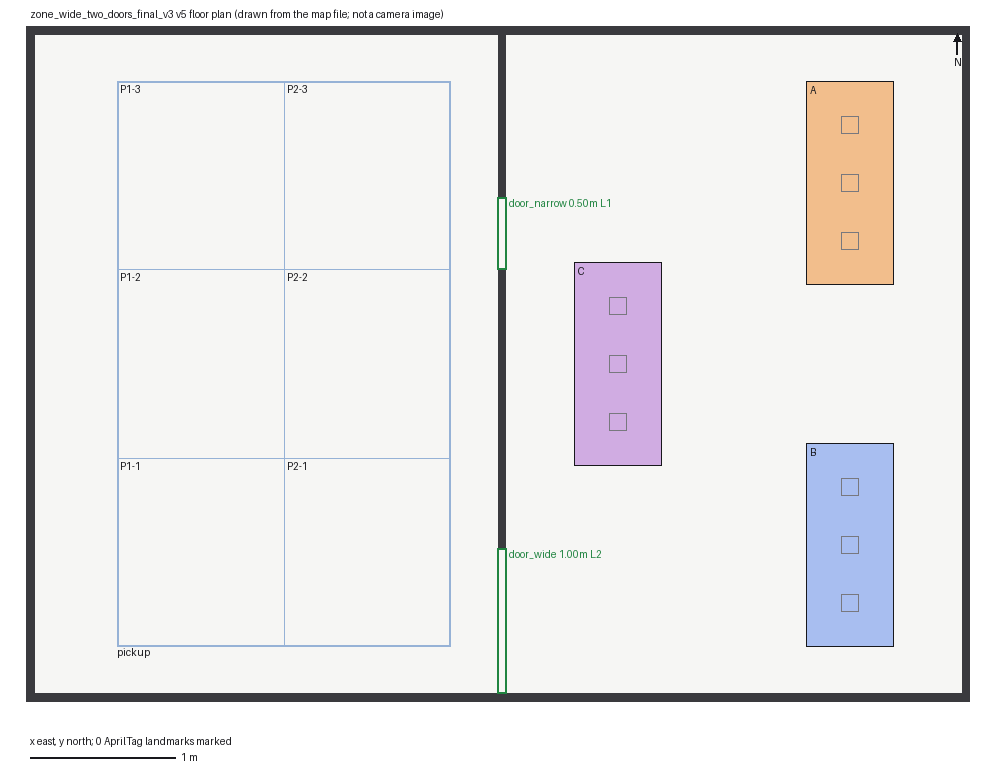
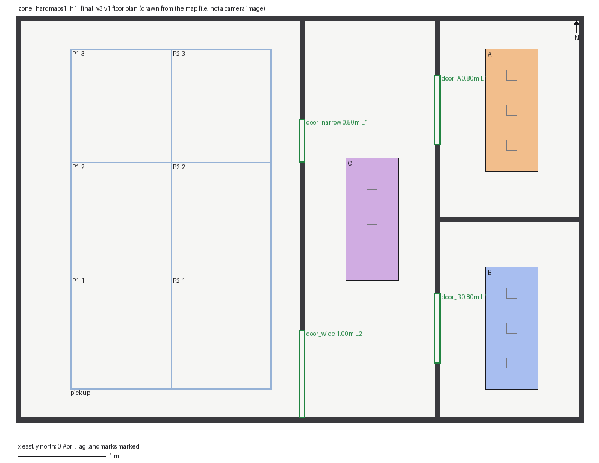
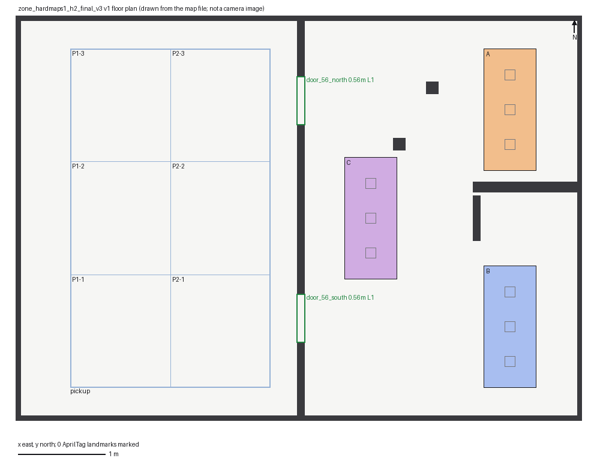

# hardmaps1 — 시각 단서를 유지한 held-out 맵 2개 준비

2026-10-09 사용자/감독 지시. 개발 튜닝·탐색·귀환 시행 **0회**. 준비된 정적 지도이며 학생 성공이나 실제 통과 결과가 아니다. 지도 파일은 기본 suite/시나리오/실행 registry에 등록하지 않았다. H3는 선택 사항이므로 이번에는 H1/H2 두 구조를 준비했다.

## 설계와 도면

- **H1 `zone_hardmaps1_h1_final_v3`**: 서쪽 pickup, 중앙 C, 동쪽 A/B의 4개 방. A/B 방은 출입구가 하나인 막다른 방이다. 서쪽→중앙은 기존 50cm/100cm 문 중 선택, 중앙→A/B에는 80cm 문을 추가했다. B까지 서로 다른 접근 경로가 있다. 기존 두 문을 각각 하나씩 막은 정적 대조에서도 B 도달 경로를 확인했다.
- **H2 `zone_hardmaps1_h2_final_v3`**: 남/북 56cm 문, 엇갈린 기둥, 오른쪽 막힌 가지와 아래 우회. `maps/navigation/narrow-door.json`, `staggered-obstacles.json`, `blocked-branch.json`의 각 XY 사각형 크기를 그대로 재사용했다. 평행 이동, blocked-branch의 좌우 반사만 적용하고 벽 높이는 공통 40cm로 맞췄다. 변환과 원본 파일 SHA-256은 맵의 `heldout.geometry_sources`에 있다. 기존 최대 100cm 통로가 56cm로 좁아지며, 모든 문이 56cm이다(기준의 최소 50cm보다 좁다는 주장은 아니다).





지도 schema는 `ugrp.zone_arena.v1`, 위치는 `maps/zones_final_v3/`, 각 신규 지도 자체의 version은 1이다. 이름의 `final_v3`는 로봇/환경 계열이다. 경기장 6.45×4.60m, 외벽, 카메라 위치/FOV, 로봇 모델, pickup/A/B/C 색/범위, 9개 슬롯, 동쪽 접근 규칙과 seeded 시작 행을 모두 보존했다. 어떤 새 벽도 기존 색 구역이나 그 경계를 덮지 않는다.

## 시각 단서 비교

같은 29.67m² 경기장 기준이다. `floor_light_v1`과 기존 `tape_v1` 외관을 적용한다. 바닥 checker의 texture/material/texrepeat와 색 구역은 그대로다. 벽 테이프는 동일한 SHA-seeded face 생성기(seed 16001, 테이프 간격 20–30cm, 폭 2–3cm, 불규칙 작은 패치)를 그대로 사용한다.

| 단서/규칙 | 기준 두 문 | H1 | H2 |
|---|---:|---:|---:|
| 색 구역 수 (pickup 포함) | 4 | 4 | 4 |
| 색 구역 경계 길이, m | 24.4 | 24.4 | 24.4 |
| 경계 길이 / 경기장 면적, m/m² | 0.8224 | 0.8224 | 0.8224 |
| 벽 수 | 6 | 10 | 13 |
| 벽 높이, m | 0.40 | 0.40 | 0.40 |
| 벽면 테이프 수 | 215 | 262 | 251 |
| 불규칙 벽 패치 수 | 570 | 662 | 592 |
| 테이프 / 경기장 면적, 개/m² | 7.2464 | 8.8305 | 8.4597 |
| 바닥 checker 간격·대비 | 기준 유지 | 동일 | 동일 |
| 외벽 테이프/패치 배치 | 원본 | 동일 | 동일 |

벽 무늬 수는 생성기가 만드는 네 수직 면 전체를 센 값이며, 카메라가 매 순간 볼 수 있는 개수는 아니다. 새 벽/방에 의한 가림과 노출 바닥 면적 변화는 구조 난이도의 일부다. 벽면 단위 패치 수나 실제 검출률을 개선했다는 주장은 하지 않는다. 기준 전체 face 배치(좌표·테이프·패치)가 `claude/ego-wall-map`의 원본 `assets/layout.json`과 일치함을 확인했다. H1은 기존 내부 벽 무늬도 보존하고, H2의 변경된 벽만 같은 생성 규칙으로 다시 만든다.

## 정적 통행 검사

실행 소스 **b431ec86749a5f89ee136c6d44a5d7f81dd8bf27** (전체 SHA는 `static-summary.json`). 2.5cm 격자에서 4-neighbor BFS로 작성 장애물을 팽창해 탐색하고, 모든 경로 선분의 연속 swept AABB를 다시 확인했다. 시작/목표를 가장 가까운 격자로 무조건 옮기지 않고 실제 endpoint↔격자 연결도 같은 충돌 검사로 확인한다. 막힌 문 두 개를 모두 봉쇄한 음성 대조는 경로를 거부한다.

MasterPi v3 공식 외형(길이 0.185m·폭 0.162m, `sim/masterpi_geometry_v3.py`)보다 큰, 전방 팔 공간을 포함한 무하중 body-frame envelope `x=[-0.100,0.300]`, `y=[-0.130,0.130]m`에 각 방향 **25mm 여유**를 더한다. 최종 0.450×0.310m 직사각형이다. 방향은 표준 시작에서 0, 기존 ego 시작에서 π로 고정한 mecanum 평행 이동이다. 임의 팔 자세/짐·제자리 회전/동적 다른 로봇·화물은 이 증거 범위가 아니다. 초기 컴파일 충돌 geom AABB와 envelope의 포함 관계도 정지 장면 확인에 기록한다.

| 시작 집합 | 목표 | H1 | H2 |
|---|---|---:|---:|
| 표준 v3 spawn x=-0.8982, y=-2.25/-0.85/0.55 | A/B/C 중심+각 3개 슬롯, 12개씩 | 36/36 | 36/36 |
| 기존 ego 시작 (3.25,0.75), yaw=π | 같은 12개 목표 | 12/12 | 12/12 |
| H1 기존 좁은 문 / 넓은 문 개별 봉쇄 | 서쪽 중간 시작→B | 2/2 | 해당 없음 |

색 구역 중심과 가운데 슬롯은 동일한 좌표지만 서로 다른 목표 이름이다. 따라서 48개 query 통과는 48개 독립 목표/연구 표본이나 성공률이 아니다. 같은 정적 경로를 역순으로 쓰면 시작점으로도 연결되지만 실제 자기 지도 귀환을 실행하거나 검증하지 않았다.

## 하네스 호환과 격리

`claude/ego-wall-map`의 **e52c6d6011479be0731acd53c43ff853b6897ae3**을 `git show`로 읽었다. `scripts/run_own_map_return_repeat.py`는 `--seed`, `--output`, `--expected-source-sha`, `--execute`만 받으며 맵 인자는 없다. 상속한 `run_active_wall_rotleft.frozen_bundle`은 map_id/시작/B 목적지를 고정한다. 기존 `FinalV3Scene` resolver와 world builder의 allow-list/해시 검사, tape asset의 벽 좌표 검사도 새 맵을 자동 허용하지 않는다. **현재 귀환 CLI에 새 맵을 바로 전달할 수 있다는 주장을 하지 않는다.**

이번 브랜치의 `sim.zone_heldout_scene.install(scene, heldout_map='off')`는 기본 off에서 같은 scene 객체를 그대로 반환한다. 명시적인 신규 ID일 때만 기존 표준 `FinalV3Scene` 구성의 static_map을 바꾸며 시작/화물/카메라는 보존한다. 준비 스크립트만 이 어댑터를 사용한다. 벽 무늬 생성기는 원본 그대로 `sim/heldout_wall_texture_source.py`에 보존했고 출처/해시는 `texture-source.json`에 있다. 이 파일의 기본 자산 경로는 원본 것이므로 준비기는 항상 새 출력의 assets 경로를 명시한다.

후속 감독이 귀환 실행을 지시할 때 별도 동결 bundle/CLI map 선택, map/file/texture 해시 admission, world builder의 명시적 지원을 함께 추가해야 한다. 작성 지도/정적 정답 경로를 자기 지도 제어기의 입력으로 주지 않는다. 검사 경로는 준비 평가 전용이다. 이 브랜치는 기존 하네스·controller/freeze/기본 실행 목록을 수정하지 않는다.

## 검증 기록과 재현

- 관련 시험 파일 하나: `tests/test_zone_heldout_maps.py`, **8 passed**. 경계/색/시작 불변, 단서 비감소, 전체 도달성, 봉쇄 음성 대조, 56cm와 rigid reuse, off 동일성/원본 생성기 hash.
- `static-summary.json`: 목표별 경로 길이, 단서 수, raw 위치/해시. 전체 XY 경로는 로컬 raw `outputs/hardmaps1-static-frozen-b431ec86/static.json`에 보존한다. 선행 작성 확인 `outputs/hardmaps1-static-v1`은 실행 전 개발 검사이며 별도 보존한다.
- `reservation.json`: main과 열린 PR 17개 브랜치 map ID 충돌 검사·SHA·RUNNABLE_ID 조회. 신규 map ID 2개만 예약했고 실행 bundle/workflow 번호는 만들지 않았다.
- MuJoCo 정지 장면: S2 공용 잠금 사용 중이므로 대기 중. 기존 PID/프로세스/우선순위를 변경하지 않는다.
- PNG는 각각 17KiB 미만. raw/무늬 PNG/XML은 기본 checkout의 `outputs/`에 보존하며 원격 백업이라고 부르지 않는다. UGRP 예외에 따라 Drive를 사용하지 않는다.

```sh
/Users/changmin/projects/ugrp/.venv-sim-worker-mac/bin/python -m pytest -q tests/test_zone_heldout_maps.py
/Users/changmin/projects/ugrp/.venv-sim-worker-mac/bin/python -m scripts.prepare_zone_heldout --output /absolute/new-output
# 공용 잠금이 비었을 때만: 표준 Scene의 정지 XML 로드/forward/렌더, mj_step 0회
python3 scripts/ugrp_session.py run hardmaps1-stationary-NEW -- \
  /Users/changmin/projects/ugrp/.venv-sim-worker-mac/bin/python -m scripts.prepare_zone_heldout \
  --stationary --output /Users/changmin/projects/ugrp/outputs/hardmaps1-stationary-NEW
```

`--write-maps`는 초기 저작 시에만 쓰며 기존 지도 파일이 있으면 거부한다. 모든 실행 출력 경로도 덮어쓰기를 거부한다. 정지 확인은 0 SIM초의 초기 장면이며 운전·물리 안정성·완주 시험이 아니다.

## 참고 자료

- [LaValle, Planning Algorithms §4.3](https://msl.cs.uiuc.edu/planning/node156.html): 작성 장애물의 configuration-space 확장과 연결 경로 검사. 본 검사에서 방향 고정 직사각형의 Minkowski 확장을 사용한다.
- [Nav2 footprint 안내](https://docs.nav2.org/rolling/configuration_and_development/first_time_robot_setup_guide/footprint/setup_footprint/), [inflation layer](https://docs.nav2.org/rolling/configuration_and_development/configuration_guide/core_servers/costmap_2d/costmap_plugins/inflation/): 로봇 외형과 여유를 포함하는 충돌 공간 원칙. ROS/Nav2 실행 성적을 주장하지 않는다.
- 저장소 `docs/act_map_suite.md`: 정적 경로·장면 준비와 실제 학생 성공 분리, 미사용 기하 보류. 기존 navigation 세 지도와 zone 표준 Scene/무늬 생성기는 위 출처에 고정했다.
