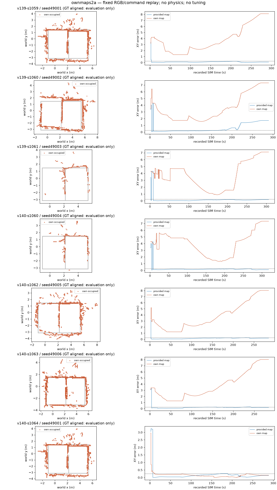

# ownmaps2a: S2 자기 지도 교체 오프라인 검증

**판정: NOT_READY — 올바른 최초 수렴 기준 7/7 → 자기 지도 1/7
(필요 6/7).** 기준 재생 7/7이 원본 pose 7필드와 정확히 일치했다.
총 41,163개 원본 RGB 프레임을 두 조건에서 각각 재생했고 본 비교의 물리 실행·렌더·모델 호출은 0이다.
`agent_lock`을 잡지 않았고 새 튜닝·GT 제어 정렬도 하지 않았다. 실제 운반 성공은 미검증이다.

**동일 경기장 통제 비교가 아니다.** 자기 지도 생성장의 `zone_wide_two_doors_final_v3`와
S2의 `zone_wide_door_geometry_v3`는 아래쪽 분리벽 1.025m 구간이 다르다. 저장된 정적 지도와
실제 `scene.xml` 모두에서 확인했다. [환경 감사](source-environment-audit.json)에 원본 해시를 남겼다.
요청된 기록을 그대로 비교한 DEV 진단이며, 이 차이를 전부 자기 지도의 관측 실패로 돌리지 않는다.

## 고정 소스·사전 관문

부모 `e532f52e3df512e5fac8cef7654dc2ba06fa61b1`, 최종 재생 소스
`b9a76350c2216eeffd0c1773ab155ee5865809b4`, branch `codex/ownmap-s2`.
관문은 `5b2aba3f`에서 먼저 커밋했고 [원문](preregistration.md)과
[원 등록](registration.json)을 보존했다. [registration-v2.json](registration-v2.json)은
별도 causal snapshot의 관측 landmark 발견에 따른 입력 목록 정정(`621e1694`)이다.
pair/관문/상수는 바꾸지 않았고 비교 후보 채점 전에 정정했다.
역사적 S2 결과가 적힌 README는 이미 읽은 상태이며 새 확증 코호트로 주장하지 않는다.
[구현·중단 시도 기록](implementation-notes.md)을 함께 본다.

동일 RGB·명령·seed로 off/own_grid_v1을 비교했다. v140 능동 관측도 저장된 명령만 재생했다.
후보의 새 행동은 생성하지 않았으므로 실제 후보 제어가 받았을 영상까지 검증한 것은 아니다.
7개 S2 기록에 6개 자기 지도를 고정 배정했고 49001은 두 번 사용했다. 독립 물리 시행 수가 아니다.

## 위치추정 결과

수렴은 GT와 무관하게 초기화된 report의 std_xy≤5cm 최초 선언이다. 정상 수렴은 그 시각의
평가 XY≤25cm 및 yaw≤15°이다. 오수렴 뒤 회복해도 최초 선언 판정을 바꾸지 않는다.
시간은 기록된 SIM 초, RMSE는 각 조건의 최초 선언 이후 모든 GT-covered report의 XY 오차다.
GT 정렬은 지도 생성 실행의 첫 chassis pose로 고정한 SE(2) 한 번뿐이며 ICP·궤적 fit은 없다.
XY 공분산도 같은 회전으로 옮겼다. 수렴 없음은 null이며 0으로 대체하지 않는다.

| 기록 | 지도 | 최초 판정 | 선언 SIM초 | 수렴 후 RMSE m | NEES 초과/전체 | NEES 초과/단일모드 | 무경고>25cm/원 결정 |
|---|---|---|---:|---:|---:|---:|---:|
| v139-s1059 | 기준 | 정상 | 12.100 | 0.107 | 4302/5842 | 4189/5504 | 0/468 |
| v139-s1059 | 자기 | 오수렴 | 6.950 | 4.440 | 5823/5842 | 5666/5685 | 301/468 |
| v139-s1060 | 기준 | 정상 | 91.950 | 0.963 | 5646/5767 | 5586/5605 | 0/439 |
| v139-s1060 | 자기 | 오수렴 | 6.950 | 4.058 | 5744/5763 | 5582/5601 | 328/439 |
| v139-s1061 | 기준 | 정상 | 13.950 | 0.119 | 3961/6095 | 3878/5736 | 0/496 |
| v139-s1061 | 자기 | 오수렴 | 120.000 | 4.395 | 6095/6095 | 4241/4241 | 286/496 |
| v140-s1060 | 기준 | 정상 | 91.950 | 0.162 | 6215/6336 | 6155/6174 | 0/477 |
| v140-s1060 | 자기 | 오수렴 | 194.950 | 5.197 | 6336/6336 | 3732/3732 | 157/477 |
| v140-s1062 | 기준 | 정상 | 21.550 | 0.160 | 5087/5681 | 5087/5362 | 0/448 |
| v140-s1062 | 자기 | 오수렴 | 5.450 | 4.431 | 5662/5681 | 5632/5651 | 185/448 |
| v140-s1063 | 기준 | 정상 | 82.850 | 0.212 | 5154/5663 | 5114/5344 | 30/446 |
| v140-s1063 | 자기 | 오수렴 | 3.950 | 4.348 | 5644/5663 | 5524/5543 | 227/446 |
| v140-s1064 | 기준 | 정상 | 11.150 | 0.137 | 5058/5751 | 4984/5432 | 25/403 |
| v140-s1064 | 자기 | 정상 | 12.000 | 0.153 | 5041/5751 | 1911/2071 | 7/403 |

NEES는 chi²(2,95%)=5.9914645471 초과 수이며 단일모드 열은 선택 cluster/보고 공분산이
일치하는 경우만 포함한다. 전체 다봉 NEES는 기술통계다. 무경고는 원본 drive 결정 시각에서
기존 불확실성 규칙을 재계산한 값이다. 원본 결정 시각을 사용했지 재생 controller를 실행하지 않았다.
오수렴은 기준 0 → 자기 6,
무경고>25cm는 기준 55/3177 →
자기 1491/3177이다.
XY/yaw별 오수렴, 최초 오차, 모든 관문과 정확한 분모는 [result.json](result.json)에 있다.
기준도 안정적인 완주/불확실성 보정의 증거는 아니다. v139-s1060의 수렴 후 RMSE는 0.963m이며,
기준 NEES 초과는 35,423/41,135(86.11%), 자기 지도는 40,345/41,131(98.09%)이다.
자기 지도 6개 오수렴은 최초 yaw 오차 150–179°의 반대 방향 모드였다. 유일하게 정상 수렴한
v140-s1064/49001은 RMSE 0.153m(기준 0.137m)였다. 같은 49001을 쓴 v139-s1059는 실패했으므로
지도 ID 하나만으로 결과를 설명하거나 v140의 인과적 개선으로 주장하지 않는다.

| 등록 관문 | 판정 |
|---|---|
| `all_seven_complete` | PASS |
| `all_baselines_identical` | PASS |
| `nonzero_correct_baseline` | PASS |
| `retention` | FAIL |
| `rmse_all_correct_baseline_pairs` | FAIL |
| `wrong_modes_nonincreasing` | FAIL |
| `unflagged_nonincreasing` | FAIL |
| `nees_nonincreasing` | FAIL |
| `no_missing_scores` | PASS |



왼쪽은 평가 전용 GT 정렬 자기 점유 셀(주황)과 S2 GT 벽(회색), 오른쪽은 각 조건의 XY 오차다.
운반 궤적 성공 그림이 아니다.

## 어댑터의 입력과 빠진 항목

`harness/ownmap_s2.py`의 `convert(..., option='off')` / `build_runtime(..., option='off')`가
기본 경로다. `own_grid_v1`일 때만 최종 자기 grid의 좌표를 그대로 사용한다. 양수 log odds는
occupied, 음수는 observed free, 0·미관측은 unknown이다. 시작 입자는 observed free와 전체 yaw에
균등 분포하며 저장된 pose/particles를 prior로 쓰지 않는다. 동작 뒤 unknown도 free로
간주하지 않고 기존 map wall penalty를 받는다. 벽은 1cm EDT/2m truncation으로
기존 sensor 상수·AMCL/KLD·운동·카메라 calibration과 결합했다.

관측된 partial floor edge와 door만 원래 hue·normal·좌표·출처로 연결한다. 6천여 edge는 ML
대응 후보이지 독립 증거 수가 아니다. 128-particle tile은 기존 수학을 그대로 계산하는 메모리
제한이며 후보 pruning·가중치/잡음 조절이 없다. partial B bbox의 네 변을 경계로 만들지 않는다.

| S2 기록 | 자기 지도 | 관측 floor edges | 관측 doors | 부분 구역 | pickup/delivery 슬롯 |
|---|---|---:|---:|---:|---|
| v139-s1059 | seed49001 | 6360 | 0 | 1 | 없음 |
| v139-s1060 | seed49002 | 6452 | 0 | 1 | 없음 |
| v139-s1061 | seed49003 | 0 | 0 | 0 | 없음 |
| v140-s1060 | seed49004 | 0 | 0 | 0 | 없음 |
| v140-s1062 | seed49005 | 6163 | 1 | 1 | 없음 |
| v140-s1063 | seed49006 | 6364 | 0 | 1 | 없음 |
| v140-s1064 | seed49001 | 6360 | 0 | 1 | 없음 |

모든 지도에서 완전한 바닥 구역 경계·명명된 정적 문 경로·슬롯·벽 높이·미관측 공간은 제공되지
않는다. 슬롯/tag를 GT로 채우지 않았다. 형상 호환용 rectangle의 높이 0은 미관측 placeholder다.
운반 제어에 쓰지 못하도록 `step/drive/_control`은 명시적으로 차단한다. 기존 S2 실행기와
`claude/ego-wall-map` branch 파일은 수정하지 않았다. `graph-runtime-v1` egomap47 grid는 4,303개 셀·own frame 보존과 field 생성을 별도 확인했다
([형식 감사](graph-format-audit.json)). graph/의미 단서 연결이나 위치추정 성능 확인은 아니며
이 7쌍의 성능 분모에는 포함하지 않았다.

## 실패 원인의 분리

- **관측 지지/빈 영역:** 49003/49004의 공통벽 40cm coverage는 45.66%/48.70%이고,
  첫 GT 표본 위치는 unknown이었다. GT 궤적 unknown은 5,241/6,159(85.10%)와
  5,652/6,400(88.31%)이다. 49002/49006의 첫 GT 위치는 occupied였다. 따라서 4쌍은
  해당 위치가 observed-free 초기 샘플링 지지에 포함되지 않는 입력 문제를 확인했다.
- **형상 어긋남:** 생성장 벽까지 median 0.080–0.230m, p90 0.430–0.830m이다.
  일부 격자 outlier는 2.13–3.03m에 이른다. GT 지원 벽을 평가에서 섞으면 true-pose wall
  평균 log-score가 0.007–0.315 증가하지만, 잘못된 posterior 모드의 회복을 입증하지 않는다.
- **색/문 단서:** 49003/49004의 경계 snapshot이 없어 실제 floor feature가 기준 160/201개에서
  0/0개가 된다. 나머지는 floor feature가 있어도 5쌍 중 4쌍이 오수렴하므로 단서 개수 부족만으로
  설명할 수 없다. 실제 door feature는 두 조건 모든 기록에서 0이며 문 항목 누락을 이 자료의
  직접 실패 원인으로 주장하지 않는다.
- **남은 불확실성:** 반대 방향 모드 선택과 과신은 재현했지만, 각 벽·바닥 관측이 posterior에
  기여한 인과 효과는 분리하지 못했다. 추가 모드 점수 probe는 report 전달 시각과 t_est를
  혼동한 v1을 폐기 판정했다(원본 보존). v2는 정확한 관측 시각의 estimate가 없어 전부
  unavailable로 막는다([기록](mode-score-diagnostic-v2.json)). 주 평가는 처음부터 t_est에 GT를
  맞췄으며 이 보조 probe와 무관하다. 픽업·운반 연결 전 동일 장면/정확한 관측 시각 상태 기록이 필요하다.

벽 어긋남은 자기 지도 생성장 GT 벽까지의 **상한 없는** 거리로, 빠진 영역은 두 원본 장면에
공통인 벽의 coverage로 분리했다. 프레임의 고정 강체 변환 뒤 잔차이므로 지도 drift/변형도
포함하며 벽의 국소 오차만을 뜻하지 않는다. 원 evaluator의 거리 2m 포화와 구분해
[source-diagnostics.json](source-diagnostics.json)에 uncapped 거리도 저장했다.

| 기록 | 자기→생성장 벽 median/p90 m | 공통벽 coverage 20/40cm | 대응 hue 경계 없음/관측 | 대응 문 없음/관측 | GT 벽 혼합 log-score 증가 |
|---|---:|---:|---:|---:|---:|
| v139-s1059 | 0.230 / 0.730 | 80.5% / 99.7% | 0/155 | 0/0 | 0.081 |
| v139-s1060 | 0.230 / 0.730 | 67.8% / 87.7% | 0/157 | 0/0 | 0.315 |
| v139-s1061 | 0.130 / 0.430 | 36.2% / 45.7% | 160/160 | 0/0 | 0.200 |
| v140-s1060 | 0.080 / 0.730 | 40.7% / 48.7% | 201/201 | 0/0 | 0.162 |
| v140-s1062 | 0.130 / 0.830 | 89.1% / 99.6% | 0/139 | 0/0 | 0.007 |
| v140-s1063 | 0.130 / 0.680 | 93.2% / 100.0% | 0/136 | 0/0 | 0.042 |
| v140-s1064 | 0.230 / 0.730 | 80.5% / 99.7% | 0/243 | 0/0 | 0.291 |

GT 혼합은 평가 스크립트에서만 자기 벽 + 관측 지원(40cm) 안의 GT 벽을 합친 field다.
원본 sensor packet을 GT pose에서 점수화했으며 PF/명령/수렴 판정에는 넣지 않았다.
점수 증가는 nearest-wall min 연산에서 기대되는 기하 진단이며 그만큼 위치추정이 회복된다는
인과 증거가 아니다. 전체 GT 벽 점수와 floor/door 점수도 원본에 따로 남겼다.
floor hue 후보의 존재는 정확한 대응을 보장하지 않는다. S2 floor 검출은 map hue 목록에
조건부이므로 동일 RGB여도 실제 추출 packet은 다를 수 있다. 조건별 실제 packet/feature 수를
진단 JSON에 별도 기록했다. 위 oracle은 비교용으로 원본 기준 packet을 공유한다.
feature packet이 비면 likelihood=1이고, packet에 feature가 있으나 지도 후보가 없으면 기존
random component만 남는다. 이 절대 점수만으로 의미 단서 품질을 순위화하지 않는다.
기존 wall sigma=0.2m, floor 거리 sigma=0.1m/방향 5°는 고정했고 자기 지도 불확실성에
맞춰 넓히지 않았다. 저장된 edge covariance는 출처로 보존되지만 기존 S2 점수식이 사용하지 않는다.
장면 차이·관측 공백·벽/의미 단서 오차가 함께 있어 한 요인만의 효과 크기는 식별하지 못했다.

## 검증·산출물

변경 모듈 시험 `tests/test_ownmap_s2.py` **14 PASS**. 기본 off, free/unknown 경계, GT/peer/future
landmark 거부, partial bbox 경계 금지, 273개 pose의 기존 likelihood 일치(rtol 2e-12),
실제 speedup+고정 calibration 생성자, GT 평가 공분산 회전·관문 누락 거부를 확인했다.
로컬 전체 시험은 돌리지 않았다. 경량 CI의 MuJoCo 미설치로 speedup 생성자 시험이 실패한
건은 선택 의존성 skip으로 수정하고 실제 로컬 14 PASS와 분리한다. 기존 원격 CI의
시뮬레이션 smoke는 프로젝트 검사이며 본 오프라인 비교의 물리 결과가 아니다.
원격 CI 상태/최종 전달 해시는 `delivery.json`에 분리한다.

- 최종 replay 원본: `/Users/changmin/projects/ugrp/outputs/ownmaps2a-20261009-r3`. 14개 prediction의 소스·입력·프레임·출력 SHA256 보존.
- 평가 원본: `/Users/changmin/projects/ugrp/outputs/ownmaps2a-20261009-r3-evaluation`. 전체 pose series·단서별 oracle은 이 로컬 경로에 있다.
- 이전 r1(입력 목록 정정 중단)·r2(speedup 생성자 HOST_ERROR 및 부분 재생)는 삭제하지 않았다.
  최종 r3는 전 조건을 고정 소스로 새로 실행했다. 인프라 수정이며 결과 기반 튜닝이 아니다.
- [TensorBoard](http://127.0.0.1:6006/?runFilter=%5E1009-ownmaps2a-r3%2F&smoothing=0&pinnedCards=%5B%7B%22plugin%22%3A+%22scalars%22%2C+%22tag%22%3A+%22offline%2Fcorrect_convergence%22%7D%2C+%7B%22plugin%22%3A+%22scalars%22%2C+%22tag%22%3A+%22offline%2Fpost_rmse_m%22%7D%2C+%7B%22plugin%22%3A+%22scalars%22%2C+%22tag%22%3A+%22offline%2Fnees_fraction%22%7D%2C+%7B%22plugin%22%3A+%22scalars%22%2C+%22tag%22%3A+%22offline%2Funflagged25cm_count%22%7D%2C+%7B%22plugin%22%3A+%22scalars%22%2C+%22tag%22%3A+%22result%2Fwall_s%22%7D%2C+%7B%22plugin%22%3A+%22scalars%22%2C+%22tag%22%3A+%22result%2Fcommands%22%7D%2C+%7B%22plugin%22%3A+%22scalars%22%2C+%22tag%22%3A+%22result%2Fmodel_calls%22%7D%5D#timeseries): 새 native snapshot `1009-ownmaps2a-r3`, 기준/자기 14 run.
  성공 지표는 최초 정상 위치수렴이며 운반 성공이 아니다. wall_s는 재생 처리 시간,
  model_calls=0, 외부 모델 비용 0, 모델 지연은 해당 없음. 새 영상 0이라 영상 등록도 해당 없음.
- 결과 JSON·그림·입력/환경 해시는 Git에 보존한다. 원본 RGB와 전체 trace의 로컬 보관을
  원격 백업으로 표현하지 않는다. Google Drive 조회·업로드는 하지 않았다.

TensorBoard의 이벤트/HTTP 로딩과 Time Series 14개 선택·7개 고정 카드·표시 수치는 확인했다.
공용 root HParams는 기존 첫 `EXPERIMENT_TAG`를 선택하는 TensorBoard 동작 때문에 새 custom
metric/condition 열을 노출하지 않는다. 기존 설정의 outcome·wall_s·commands·model_calls 열은
다시 적용했으며, 새 custom HParams 표시는 미완료다. 다른 작업의 서버를 재시작하거나 추가
대시보드 서버를 만들지 않았다. 자세한 범위는 [표시 검증 기록](tensorboard-delivery.json)에 있다.

재현(같은 로컬 raw 필요, 출력은 존재하지 않는 절대 경로):

```sh
# 이 재생은 위 b9a76350 소스에서 실행했다.
python -m scripts.replay_ownmap_s2 --output /absolute/new-replay
python -m scripts.evaluate_ownmap_s2 --replay /absolute/new-replay --output /absolute/new-evaluation
PYTHONPATH=. python experiments/2026-10-09-ownmap-s2/evaluate_source_diagnostics.py \
  /absolute/new-replay /absolute/new-evaluation experiments/2026-10-09-ownmap-s2/registration-v2.json
PYTHONPATH=. python experiments/2026-10-09-ownmap-s2/export_tensorboard.py \
  /absolute/new-replay /absolute/new-evaluation /absolute/new-tensorboard-snapshot
```

환경은 기존 `.venv-sim-worker-mac`을 사용한다. 실제 실행은 `ugrp_session.py run`으로 관리했고
priority 0, 단일 재생 프로세스였다. `prediction.started_load_average`는 구현상 봉인 시 읽은
부하 값이므로 시작 시 부하로 해석하지 않는다. 처리 시간의 성능 비교도 하지 않았다.

## 남은 통합과 참고

[연결 목록·작업량](integration.md): 연결 코드 **16–32인시** 추정(위치추정 정확도 확보 전제),
동일 장면 확인/평가 준비 4–8, 첫 위치추정 문제 해결 주기 8–16인시 별도. 해결 보장이나
실행 권한을 뜻하지 않는다. 물리 인수 준비·판정 6–12인시 + 실제 실행 시간도 별도다.
이 PR은 DRAFT이며 새 bundle·물리 실행·기본 제어기 채택·병합을 포함하지 않는다.

- [Nav2 AMCL likelihood field](https://api.nav2.org/nav2-rolling/html/likelihood__field__model_8cpp_source.html): nearest occupied field의 기존 S2 구현 재사용.
- [Nav2 AMCL 구성](https://docs.nav2.org/rolling/configuration_and_development/configuration_guide/others/configuring_amcl/): 기존 noise/센서/KLD/운동 상수 유지.
- [VLG-Loc, Aoki et al. 2025 v2](https://arxiv.org/abs/2512.12793v2): semantic correspondence를 MCL에 연결하는 참고 방향. VLM·논문 성능을 이 실험에 도입하지 않았다.
- [pytest 선택 의존성 skip](https://docs.pytest.org/en/stable/how-to/skipping.html#skipping-on-a-missing-import-dependency): 기존 S2 시험의 importorskip 관례를 따른 CI 의존성 수정.
- 자기 지도 `self_map_relocalize.GridField`, `self_map_causal.own_landmarks_before`는 해당 branch에서 읽기만 참고했다.
