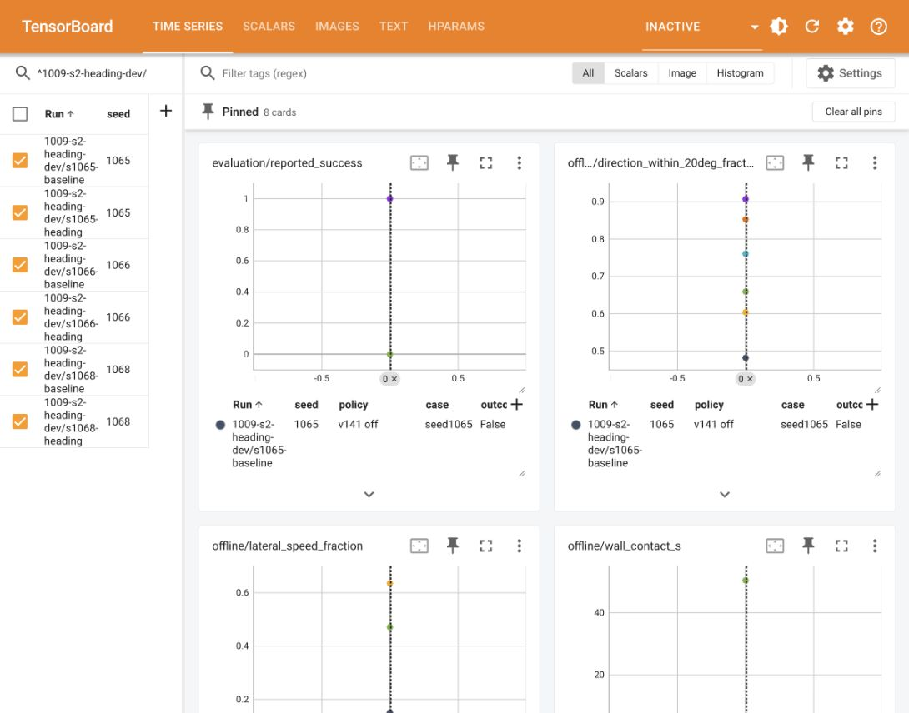
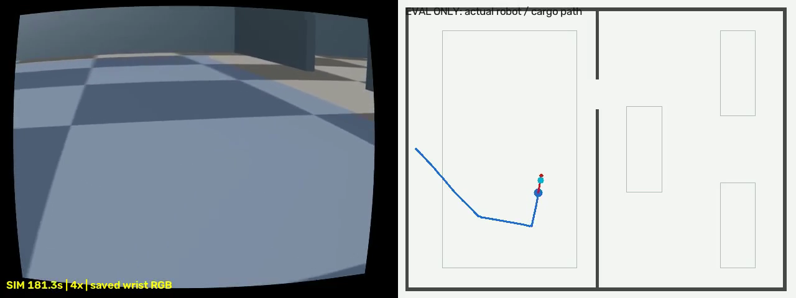

# S2 heading · 비교 DEV (2026-10-09)

사용자: 이동 시 동쪽을 보며 옆으로 가는 주행을 경로 방향으로 회전 후 전진하도록 변경.
`codex/s2-heading`, 기준 `99d81d8c`/v141. 진행 중인 s2-realism은 수정하지 않는다.
3개 기존 seed 1066/1068/1065를 비교하며 졸업·신규 확증 표본으로 세지 않는다.
[사전 기록](registration.json), [번호 조회](reservation.json). 새 v143/7.36.0, DRAFT PR.

## 표준 방법 조사

- Coulter, [Implementation of the Pure Pursuit Path Tracking Algorithm](https://www.ri.cmu.edu/publications/implementation-of-the-pure-pursuit-path-tracking-algorithm/): 경로의 전방 목표를 차체 좌표로 변환하는 고전적 추종법. 원문 상세는 이번 조사에서 미확인.
- Macenski et al., [Regulated Pure Pursuit for Robot Path Tracking (2023)](https://arxiv.org/abs/2305.20026): 곡률·장애물 접근·목표 접근에 따라 속도를 조절하는 Nav2 RPP. 논문 초록 확인.
- [Nav2 공식 RPP README](https://github.com/ros-navigation/navigation2/blob/main/nav2_regulated_pure_pursuit_controller/README.md), [공식 현재 C++ 구현](https://api.nav2.org/nav2-rolling/html/regulated__pure__pursuit__controller_8cpp_source.html): `use_rotate_to_heading`, `atan2(carrot.y, carrot.x)`와 제자리 회전, `max_angular_accel` 및 정지 거리로 각속도를 제한한다. 코드 322–369행 확인.

우리 변경은 RPP 전체 이식이 아니라 **경로 접선/전방 목표 방향 정렬 → 전진** 규칙의 펄스 제어 적용이다.
MasterPi의 최소 PWM 때문에 임의 저속·연속 가속 램프를 만들지 않는다. 기존 실측 turn ±.35/.10s와
전체 coast·지연된 최신 PF 관측 대기를 그대로 사용한다. 기존 v141보다 회전 속도·각가속도 펄스를
키우지 않는다. 운반도 별도 하중 펄스의 같은 상한을 사용한다. 이것은 물리 각가속도의 새 실측 보증이 아니다.
능동 관측은 기존 RGB 측정 ±90° guard/횟수/시간 예산을 그대로 유지한다. 주행 방향 회전과 능동 관측을
별도로 기록하며, 능동 관측 guard를 주행 yaw 기준으로 초기화하거나 우회하지 않는다.

## 구현·검증 범위

`heading_mode=path_tangent_v1`, 기본 off. off는 v141 factory와 bundle을 그대로 반환한다.
on은 cooperative MRO에서 펄스 주행만 교체하므로 위치추정·미끄럼 회복·능동 관측·카메라 자세를 보존한다.
먼 이동은 제자리 turn 후 양의 forward만 선택하며 중간 waypoint 근처라고 옆걸음을 허용하지 않는다.
최종 작업 목표 0.10m 안에서만 기존 동쪽 작업 방향을 맞추고 .35/.06s 미세 옆걸음을 허용한다.
판정·GT 좌표는 제어기에 전달하지 않는다.

저장 기록 재생은 같은 기록 입력에서의 제안 명령 비교와 보정 모델상의 경로 재생이다. 새로운 RGB,
접촉, 미끄럼, 완주 결과를 재현했다는 뜻이 아니다. 실제 비교 DEV는 대기열 뒤에서 한 번에 하나씩 수행한다.
원본·영상은 primary outputs에 보존하며 로컬 보관을 원격 백업으로 표현하지 않는다.

## 완료 범위

고정 소스 `b60acdca6e1c0c477d650b47717b84edb3f08a06`로 비교 DEV3회 완료.
1066 성공,1068/1065 실패이며 아래 최종 결과·한계를 따른다. DRAFT #419 유지.

## 오프라인 결과 (실행 전)

바뀐 시험 파일 **17 PASS**(30.94s), 앞선 dependency 두 파일13개 PASS. 최초 방향 부호 시험2건은
±π 근처에서 짧은 펄스의 오버슈트를 최소화하다 반대 방향을 골라 실패했고, wrap한 오차의 부호를
우선하는 Nav2 규칙으로 수정 후 통과했다. [검증](verification.json).
기본 off의 실제 v141 factory record/RNG/bundle 바이트 동일, 주행 경로·명령·이벤트 동일을 확인했다.
기존 v141 관련 소스는 수정하지 않았다. 표준 workflow plan도 실행 없이 통과했다.

[기록 재생 요약](offline-summary.json): 저장된 **1,757/1,757 제안 명령 off 바이트 동일**.
같은 기록 입력에 새 selector를 적용한 옆걸음/이동 명령시간 비율은 아래와 같다.

|seed|v141 제안|새 제안|기존 전체 발행 명령|보정 평균 모델 경로 도착 off/on|
|---:|---:|---:|---:|---:|
|1066|46.879%|3.654%|43.842%|4/4 · 4/4|
|1068|40.529%|2.146%|37.441%|6/6 · 6/6|
|1065|10.347%|0.547%|10.347%|74/74 · 74/74|

분모는 명령 비영(非零) 시간이며, 실제 발행 통계는 hold/다음 base 명령/expiry의 이른 종료를 반영한다.
제안 통계는 각 후보 pulse duration의 합이다. **새 방식이 바꾼 이후 영상은 없으므로 이 비율은
실제 새 실행 비율이 아니다.** 84개 저장 A* 계획의 보정 모델 재생은 평균 응답 가정의 도착일 뿐,
실제 문 통과·미끄럼·성공의 근거가 아니다. v141 DEV direct fallback은 경로 이벤트가 없어 waypoint를
목표로 표시했다. 원본 SHA와 실패한 replay v1/v2도 보존했다.

추가 발견: 기존 집기 정렬 옆걸음은 목표 오차 최대0.849m(s1066)/0.920m(s1068)였다.
새 옵션은 시각 정렬의 먼 이동 제안도 회전/전진 펄스로 바꾸고 coast+최신 추정을 기다린다.
미끄럼 BackUp은 목표10cm 밖에서 기존 전후 펄스만 후보로 유지한다.

기준 s1068은 v141의 동시 쌍 실행이었다. 새 세 실행은 직렬이므로 wall/SIM 차이는
방향 제어 효과와 호스트 동시 부하를 분리해서 해석해야 한다.

추가 검증18 PASS(22.21s): 잠금이 잠깐 비어도 s2v59/S3/egomap54 네 seed/simspeed의
종료 영수증이 없으면 실행을 거부한다. 평가 도구는 운반 중 상자 절대 yaw와 로봇 대비 상대 yaw를
분리하고, 벽 접촉 표본시간·문 중앙 통과·능동 회전 실측 범위를 읽기 전용으로 계산한다.
4배속 영상은 왼쪽 저장 손목 RGB, 오른쪽 **평가 전용 실제 궤적**의 정사영 도면이다.
카메라 재렌더링·시뮬레이터 재실행·정답의 제어기 환류는 없다. 기준1066의 운반 상자yaw범위57.73°와
상대yaw범위0.331°는 서로 다른 값이며, 회전 자체를 곧바로 상자 미끄럼으로 해석하지 않는다.

heading2 지시에 따라 실행 전 대기열을 `[s2v59, S3]`로 정정했다: egomap54는 감독의 강제 loss 제거 결정으로 중단·나머지 영구 취소(`supervisor-ego.md` 10/9 16:55, `cancelled_by_supervisor`), simspeed는 오프라인이므로 제외; 제어 문턱·설정 변경0.

추가 보고는 실제 병진 속도≥0.01m/s 구간의 진행 방향 대비 차체 yaw ±20° 시간 비율과 `∫|차체 측방 속도|dt / ∫속력dt`, r3–다른 로봇 접촉 표본시간/episode를 사용한다. 이 기준은 실행 전에 고정했고 v141에도 동일 적용하며 GT는 평가에서만 읽는다. 영상은 heading2에 따라 결과와 무관하게 첫 seed1066의 4배속1개를 제공한다.

## 비교 DEV 최종 결과

[완료·조건 감사](completed.json), [전후 수치](comparison.json). 세 seed 각1회, 모두
동일 `b60acdca`/v143·nice0·단일 agent_lock·weld OFF·모델 호출0. 코호트 중 소스 변경0.
v141와 **기존 옵션 전체·공통 실행 소스 SHA-256·정적 지도**가 세 쌍 모두 같다.
추가한 옵션만 on이며, GT는 종료 평가·영상에만 사용했다. 성공은 기존 잠정 기하 DEV 판정이고
실물/E2E·졸업·새 확증·통계적 비열등성 입증이 아니다. 성공률은 **1/3→1/3**.

|seed|판정 v141→v143|진행 방향 ±20° 시간 비율|실제 측방 속도 비율|측방 명령시간 비율|
|---:|---|---:|---:|---:|
|1066|성공→성공|60.40→90.73%|63.56→6.52%|43.84→1.08%|
|1068|실패→실패|65.94→85.33%|47.13→5.74%|37.44→0.32%|
|1065|실패→실패|48.18→76.10%|15.08→7.98%|10.35→0.18%|

방향 비율은 실제 병진 속도≥0.01m/s인 구간 중 **차체 yaw와 실제 속도 방향**의 오차≤20°인 시간 비율이다.
측방 속도는 같은 구간의 `∫|차체 측방 속도|dt / ∫속력dt`; 명령시간 비율과 다른 분모다.
정지·제자리 회전은 방향 비율 분모에서 제외한다. 모두 실행 전 heading2 기록에서 정한 기준이다.

|seed|벽 접촉 초(episode) v141→v143|로봇 접촉 초(episode) v141→v143|문 중심 통과(로봇/상자) v141→v143|
|---:|---|---|---|
|1066|0.00(0)→0.00(0)|0.40(1)→0.00(0)|예/예→예/예|
|1068|50.40(88)→0.00(0)|0.00(0)→0.00(0)|아니오/아니오→아니오/아니오|
|1065|1.25(10)→0.00(0)|16.50(53)→0.00(0)|아니오/아니오→아니오/아니오|

접촉은 저장된 평가 표본 기준이며 표본 사이의 접촉까지 없었다는 보증은 아니다. 문 지표는
서→동 분리벽 **중심 통과**이고 로봇/짐 전체 외형 clearance를 별도 검증한 것은 아니다.

|seed|총 SIM초 v141→v143|wall초 v141→v143|wall/SIM v141→v143|발행 명령 수 v141→v143|
|---:|---:|---:|---:|---:|
|1066|285.75→423.95|548.68→660.43|1.920→1.558|3842→4504|
|1068|296.00→901.30|764.00→1323.16|2.581→1.468|3912→12584|
|1065|901.30→901.30|1480.80→1096.86|1.643→1.217|36798→18737|

wall/SIM은 방향 변경의 인과적 속도 개선으로 해석하지 않는다. 기준1068은 동시 쌍 실행이며
다른 seed도 호스트 부하가 다르다([실행별 부하](completed.json)). 1066은 성공을 유지했지만
총 SIM시간48.36%,wall시간20.37% 증가했다. 모델 호출은 모두0이고 모델 응답시간·금전 비용은 계측하지 않았다.

운반은 새1066에서만 발생했다. 상자 절대 yaw 범위 **57.73→179.09°**, 운반 시작 대비 최대 변화
**37.37→103.36°**; 차체 대비 상대 yaw 범위 **0.331→0.252°**, 상대 최대 변화 **0.186→0.174°**.
따라서 큰 절대 회전은 차체를 따른 경로 방향 전환이며 이 수치만으로 미끄럼을 주장하지 않는다.
새1068/1065는 운반하지 않았으므로 상자 운반 회전각은0이 아닌 **N/A**다.
능동 관측의 평가된 실제 ±90° 초과는 세 실행 모두0이며 주행 방향 전환과 별도 지표다.
[능동 관측 추가 시간](active-observation-check.json)은1066:2회9.90초(2.34%),1068:5회10.70초(1.19%),1065:5회12.10초(1.34%)다. 최대 실제 회전은 각각45.04°/11.31°/29.22°였다.
새 drop/tilt 실패0. 1066의1Hz 사후 가시성 감사(제어 입력 아님) all-clear는98.47→99.12%,
detected-clear는99.744→99.599%이며 학습/인식 정확도 지표로 승계하지 않는다.

### 실패와 S3 권고

1068은147.0SIM초 align 진입 뒤191.6초 `CYAN_ALIGN_VIEW_LOST`를 기록하고 탐색으로 돌아가
900SIM초 `LOCAL_TIMEOUT`으로 끝났다. 기존의 ‘집기 후 문 실패’를 해결한 증거가 없으며
이번에는 집기 전에 멈췄다. 1065는 마지막 `search_move`에서900SIM초 예산을 소진했다.
방향 정렬·측방 이동·접촉 지표는 좋아졌고, 사전 필요조건(1/3 유지·1066 성공·새 drop/tilt 없음·
능동 회전 상한 초과 없음)은 충족했다. 그러나 **종합적으로 기존보다 나쁘지 않다고 확정하지 않는다**:
1066 시간 증가와1068 정렬 시야 상실이 남았다. **S3 기본 채택은 보류하고, 감독이 선택할 DEV 비교
옵션으로만 `path_tangent_v1`을 유지하는 것을 권고한다.** 기본 off 유지, 이번3회 뒤 추가 실행·튜닝0.

### 기록·영상·TensorBoard

원본은 `/Users/changmin/projects/ugrp/outputs/s2-heading-b60acdca-s<seed>-v143`에 보존했다.
각 결과의 원본 SHA-256은 `result-s<seed>.json`의 provenance에 있다. 로컬 raw는 원격 백업이 아니다.
1065의 첫 호출은 simspeed2의 살아 있는 잠금으로 **물리 시작 전 거부**됐다. 감독에게 PR420으로
알리고 기다린 뒤 같은SHA로 미실행1065만 실행했다. 이 거부를4번째 물리 시도로 세지 않는다.
초기 b20b 대기기는 heading2 대기열 정정으로 실행0회 상태에서 종료했으며 두 대기 기록도 보존했다.

- [4배속1066 영상](http://127.0.0.1:6007/video/63dceac77fc57ed37436): 실행 전 첫 seed로 지정,1280×480·20fps·2099frames·104.95초·1,886,669bytes. 왼쪽 저장 손목RGB,오른쪽 평가 전용 실제 경로 도식(공용 top 카메라 영상 아님). 원본 프레임 해시/전체 디코딩/브라우저 실제 재생 확인. SHA-256 `c8c90783c0ef15c685a1010b83795d34da35c8b2c3d64b0ab9ed097d6a78498a`. [영상 원자료](video.json). 성공1건이 전체3건을 대표하지 않으며 두 실패 영상은 이번 heading2의1개 요청에 따라 만들지 않았다.
- [TensorBoard](http://127.0.0.1:6006/?runFilter=%5E1009-s2-heading-dev%2F&smoothing=0&pinnedCards=%5B%7B%22plugin%22%3A%22scalars%22%2C%22tag%22%3A%22evaluation%2Freported_success%22%7D%2C%7B%22plugin%22%3A%22scalars%22%2C%22tag%22%3A%22offline%2Fdirection_within_20deg_fraction%22%7D%2C%7B%22plugin%22%3A%22scalars%22%2C%22tag%22%3A%22offline%2Flateral_speed_fraction%22%7D%2C%7B%22plugin%22%3A%22scalars%22%2C%22tag%22%3A%22offline%2Fwall_contact_s%22%7D%2C%7B%22plugin%22%3A%22scalars%22%2C%22tag%22%3A%22offline%2Frobot_contact_s%22%7D%2C%7B%22plugin%22%3A%22scalars%22%2C%22tag%22%3A%22result%2Fwall_s%22%7D%2C%7B%22plugin%22%3A%22scalars%22%2C%22tag%22%3A%22result%2Fcommands%22%7D%2C%7B%22plugin%22%3A%22scalars%22%2C%22tag%22%3A%22result%2Fmodel_calls%22%7D%5D#timeseries): `1009-s2-heading-dev`,6run·114수치의 원본/이벤트/실시간API 일치,8카드 pin,6run 선택과 표시 수치 확인. HParams는 outcome/wall_s/commands/model_calls4열 재적용. 공유 legacy HParams는 runFilter를 따르지 않아 여섯 행의 비교는 Time Series에서 검증했다. [검증](tensorboard-verification.json). 기존 서버/스냅샷 유지,공용 view의 자기키만 수정.
- 로컬 변경 시험19 PASS + workflow 관리 시험18 PASS. CI의 새workflow 입력 목록 누락1건을 기존 catalog 시험 표 방식으로 보완했고 후자의18개를 다시 통과했다. 제어 코드는 고정 실행 뒤 바꾸지 않았다. CI 완료를 기다리지 않으며 DRAFT 유지한다.

