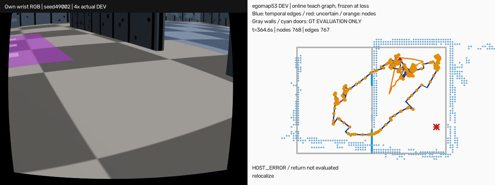

# egomap53 — teach 단계의 연속 keyframe 기록

## 참고 자료 — 코드 변경 전 확인

- [Furgale & Barfoot 2010 JFR, DOI10.1002/rob.20342](https://onlinelibrary.wiley.com/doi/10.1002/rob.20342), [저자 프로젝트 원문 설명](https://asrl.utias.utoronto.ca/~ptf/JFR_VTnR/): teach에서 스테레오 영상을 기록해 서로 겹치는 지역 지도를 연결하고 repeat에서 지역 지도에 위치를 맞춘다. 전역 일관 지도를 요구하지 않는다. 이번에 출판사 원문 초록/저자 설명은 확인했지만 전문 PDF 링크는401/404라 본문 전체 검증은 미완료다. 아래 구현 수치/분기는 논문에 임의 귀속하지 않고 직접 확인한 공개 소스에서 가져온다.
- VT&R3 **`bdb40d8ad22f02094507cc0924af8622e1ed796c`**, Apache-2.0(라이선스/파일SHA는 references에 보존). [카메라 설정](https://github.com/utiasASRL/vtr3/blob/bdb40d8ad22f02094507cc0924af8622e1ed796c/config/bumblebee_grizzly_default.yaml#L300-L309): min_distance .05m, min_creation .30m, max_creation2m, rotation min3°/max20°, stereo inlier min50/fail15. 헤더 기본(.2m/2°/1m)과 실행 YAML(.3m/3°/2m)이 다름을 구분하고 **카메라 YAML**을 고정한다.
- [SimpleVertexTestModule](https://github.com/utiasASRL/vtr3/blob/bdb40d8ad22f02094507cc0924af8622e1ed796c/main/src/vtr_vision/src/modules/odometry/simple_vertex_test_module.cpp#L50-L150): 첫 프레임 vertex; 상대 SE(3) log 이동/회전량, 작은 이동은 candidate, 큰 불연속은 odometry failure, 거리/회전/특징 수 조건으로 vertex. [StereoPipeline](https://github.com/utiasASRL/vtr3/blob/bdb40d8ad22f02094507cc0924af8622e1ed796c/main/src/vtr_vision/src/pipeline.cpp#L88-L119): 실패 시 prior로 되돌리고 보관 candidate를 keyframe으로 승격. [Tactic](https://github.com/utiasASRL/vtr3/blob/bdb40d8ad22f02094507cc0924af8622e1ed796c/main/src/vtr_tactic/src/tactic.cpp#L985-L1008): 새 vertex와 직전 vertex 사이 temporal edge를 저장.
- 반복 실패: [Tactic](https://github.com/utiasASRL/vtr3/blob/bdb40d8ad22f02094507cc0924af8622e1ed796c/main/src/vtr_tactic/src/tactic.cpp#L963-L967)는 정합 실패 시 graph/chain 갱신을 하지 않는다. [BaseMPCPathTracker](https://github.com/utiasASRL/vtr3/blob/bdb40d8ad22f02094507cc0924af8622e1ed796c/main/src/vtr_path_planning/src/mpc/base_mpc_path_tracker.cpp#L130-L136)는 isLocalized=false면 zero command, [BasePathPlanner](https://github.com/utiasASRL/vtr3/blob/bdb40d8ad22f02094507cc0924af8622e1ed796c/main/src/vtr_path_planning/src/base_path_planner.cpp#L97-L102)는 odometry failure에도 zero command. 성공한 관측 뒤만 path tracking 재개. 회복을 위해360° 돌라는 규칙은 아니다.

### 우리 제약에 필요한 변경만

단안 wrist RGB+기존 own-submap CSM/명령 오도메트리를 쓰므로 stereo feature/VO를 새로 이식하지 않는다. stereo inlier50/15는 벽 끝점 수와 단위가 달라 적용하지 않고, 기존 CSM 최소6점·수락 판정은 그대로 쓴다. keyframe 생성은 위 **SE(2) log 거리/회전 분기**를 사용한다. 원본은 VO failure에서 candidate로 복구하지만 사용자는 복구 구간 기록을 버리지 말라고 했으므로, 그 candidate와 현재 프레임을 보존하고 temporal edge를 `uncertain`으로 표시한다. 실패를 성공 제약으로 바꾸지 않는다.

일반 복구/후진/회전 상태에서도 recent 지역 관측과 연속 엣지를 끊지 않는다. 엣지에는 구간의 자기 상태·공분산·중간 자세를 보존; GT 접촉으로 연결을 고르지 않는다. 같은 장소라는 추측으로 지름길/루프를 새로 연결하지 않고 **실제 시간순 기록 엣지만** 따라간다. 로컬 CSM은 eg52 nearest5/기존 판정을 재사용하고, 실패 시 새 회전 없이 현재 RGB로 재시도하며 zero command. 정상 teach 중에는 추가 정지/회전0, 기존 frontier 명령을 바꾸지 않는다. 기존360° sensor_sweep을 추가하지 않는다.

## 실행 전 사전등록

- 옵션 **`teach_capture=vtr_keyframes_v1`**, 기본off. off는 기존 객체/trace/입자/RNG 바이트 동일. eg51/52 보존. 기존 eg49/47 탐색+eg48 가속·벽 검출 eg34·tape·SEARCH·real_v1·rotL·RBPF100/graph/switchable·360초 탐색 동결. 귀환은 시간순 traversal graph의 forward-only 추종, 실패 정합에 pose/공분산 보정0; B blacklist0.
- 키프레임: 자기 RGB 원본 참조(frame ID/SHA), 16×12 요약, 자기 추정 pose/covariance, 최근15초/12스캔 지역 patch와 관측 출처. 각 tentative B 후보의 **첫 관측 프레임을 강제 keyframe으로 고정**, 기존 floor_color_v3가 확인한 첫 B 후보에만 귀환 목표를 연결. 확인 전 tentative를 도착 목표로 쓰지 않는다. 마지막 teach 프레임도 저장. 미래 관측을 과거 patch에 넣지 않음.
- 물리 DEV **1단계 seed49001,49002 각1회**:360SIM초 탐색→기존 unknown-start(100000입자/우도.5/자기 snapshot)→최대270초 재위치/귀환. seed는 eg49 비교용으로 재사용, 새 확증 아님. 이 두 회차 모두 다음3개를 충족할 때만 **2단계49003–49006 각1회**. 미달이면 추가 물리/재튜닝0으로 종료. 미실행4건은 실패4건으로 합산하지 않음.
- 관문(결과 전 고정): **B가 자기 관측/확인됐고 loss시 마지막 노드→고정 B노드 경로 존재**, **첫 return 프레임 CSM 수락**, **기존 도착 선언+GT B안 도착**을 두 회차 각각 만족. 거짓 선언0. 접촉/회전 비율은 숨기지 않고 보고하며 추후 문턱 추가0. 엣지가 불확실한 연결 존재와 실제 통과/도착을 구분한다.
- 도착은 eg43/49 그대로 resolved5연속+추정B거리≤.20m(+traversal B노드 국소화); GT 차체 중심이 실제 B 안이어야 채점 성공. GT는 실행 후 별도 평가만, 도착 선언/경로/정합에 금지. 접촉/실제 물리 실패와 기존60분HOST상한 유지. ENOSPC=HOST_ERROR, 실행된 슬롯 재시도0. 시작 전 잠금 거부는 미시작으로 기록하고 대기.
- 표: 도착/실행수(eg49 0/6과 별도 조건), B연결, 첫정합, uncertain엣지/노드, 회전시간비(실제 발행 회전 명령 지속시간/유효 명령시간; explore/return 분리), 벽/로봇 접촉episode, 귀환소요, 종료오차/σ. 탐색 명령 byte동일 오프라인 시험으로 추가 회전0 확인; 물리 동역학 차이로 비율이 달라지면 그대로 보고.
- 한 번에 한 물리, agent_lock null일 때만 acquire·ugrp_session·dev_light·NI0/NO_BG_NICE. s2v58/hardmaps 사용 중이면 대기. 처음2회 최대2시간+대기, 통과 시 추가 최대4시간. raw6GiB 예산/여유10GiB 확인. 벽 검출/문턱 재튜닝·freeze·모델·유료/원격 자원0. PR405 DRAFT, #406/다른worktree수정0.
- raw `/Users/changmin/projects/ugrp/outputs/teach-capture-v1/seed<seed>`, 성과/실패와 미실행 사유 모두 기록. 등록 순서 첫 완료 실행을4배속 손목RGB|자기지도/teach그래프로 저장(성공/실패 명시). 성공 만들기 위한 추가 실행0. TensorBoard 생략 유지.

## 49001 실행 어댑터 오류 — 재실행하지 않음

소스 `081fcfdb`에서 물리 시작 뒤 trace 293개/RGB 303개, 마지막t=61.7s에 teach 필드0을 확인해 자기 세션만 중단했다. `grid_acceleration.install`이 인스턴스 `receive`에 기존 bound method를 포착했으므로 나중의 class 교체가 무효였다. [Python descriptor 원문](https://docs.python.org/3/howto/descriptor.html#invocation-from-an-instance)의 인스턴스 dict 우선순위와 일치한다. 이는 알고리즘 관문 실패와 구분하는 **HOST_ERROR/유효 teach 시험 아님**이며 물리 시도 분모에서 제외하지 않는다. 세션 종료가 드라이버 finally 산출물까지 남기지 못해 `result.json`은 없고 `interruption.json`+별도 부분 원장 해시를 보존했다. 죽은 자기 PID78824 잠금만 stale release.

수정은 `Return360→Teach360→scalar wrapper` 순서뿐. 이미 래핑된 객체에는 실행 전 명시적 오류를 내고, 실제 driver factory를 통해 teach 필드/누적 프레임·탐색 명령 byte동일을 검증했다. 변경3시험27통과. 최초 freeze는 `freeze-initial.json`에 보존, 나머지 seed49002에만 수정 SHA를 적용한다. 49001 재실행0, 최초 두 슬롯 모두 성공해야 하는 관문은 그대로이므로 나머지4개 추가 실행은 불가하다. 미완료 49002는 계획대로1회 진행한다.

## 실행 결과 — 관문 통과 아님, HOST_ERROR 두 건

사전등록 `e9018927`, 첫 실행 `081fcfdb`, 두 번째 실행 `4851b313`. **물리 시도2/2, 유효한 귀환 성능 시험0/2, 도착 선언0, 거짓 선언0**이다. 49003–49006은 조건 미충족으로 미실행이며 실패4회로 합산하지 않는다. 재실행/문턱 변경/다른 무늬·검출기 변경0. MuJoCo DEV이며 실물 증거가 아니다.

49002는360초 teach를 완료했다. 이어 t=365.9s(시작 후364.6s) 첫 귀환 정합 호출에서 `TypeError: super(type, obj)`로 종료됐다. `TeachGraph`에 다른 클래스의 `ReconnectedGraph.match`를 그대로 할당했으나, zero-argument `super()`가 원래 클래스를 포착하기 때문이다([Python 원문](https://docs.python.org/3/library/functions.html#super)). 이 오류는 실행 중 별도 작은 호출로 먼저 재현했으며, 실행 소스를 바꾸지 않고 teach 자료/정상 종료 처리와 오류 traceback을 보존했다. 이는 **정합 거부도, teach-and-repeat 방법의 실패 증거도 아니다.** 기존 가짜 정합 응답을 쓰는 단위시험이 실제 클래스 연결 오류를 놓친 검증 공백이다.

종료 후 공통 `match_nearest_nodes` 함수로 연결만 수정했다. nearest5·CSM·수락 기준·회전 명령은 불변이다. 수정 전 eg52 정합 결과4개(수락/명시 노드/거리 밖/점 부족)를 보존했고, 수정 후 두 graph의 출력이 모두 **4/4 byte동일**이다. 실제 드라이버 factory→loss→첫 return→실제 CSM 거부/수락 경로를 시험해 같은 예외를 방지했다. 수정 후 물리0. `freeze.json`은 두 번째 물리 소스의 기록으로 그대로 남겨 두었으므로 수정된 코드의 새 물리 실행에는 별도 사전등록/새 freeze가 필요하다.

| 조건 | 실제 실행/유효 귀환 시험 | 도착 | B 연결/첫 정합 | teach 노드/엣지(불확실) | 탐색 회전시간 | 벽/로봇 접촉 episode | 관측 기간 |
|---|---:|---:|---|---:|---:|---:|---|
| eg49 전체, 기존 귀환 | 6/기존6시도 | 0/6 | 해당 기능 없음 | — | 24.7%¹ | 4/4 | 부분 실패 포함6회 |
| eg49 동일49002 | 1/1 | 0/1 | 해당 기능 없음 | — | 21.17% | 0/0 | 630s |
| eg53 49001 | 1/0 | 0/1시도 | 미생성/미측정 | 0/0 | 38.53%² | 0/0 | 60.4s 중단 |
| eg53 49002 | 1/0 | 0/1시도 | **있음/호출 예외로 미측정** | **768/767(28)** | **21.17%** | **0/0** | 360s teach+4.6s 재위치/예외 |

¹ eg49 모든 탐색 유효 명령시간1543.2s 중 회전381.4s. ² 49001은 초기58.4s 명령시간만 있어 전체 탐색 비율과 직접 비교하지 않는다. 회전시간은 발행된 회전 펄스의 지속시간/명령 구간시간이다. eg53 49002 탐색은75.8/358s, 회전 명령 사이 간격까지 포함하면42.35%, `sensor_sweep` 상태시간은27.93%다. **전체 탐색1790개 명령이 eg49 동일 seed와 byte동일**이므로 teach 때문에 추가 정지·회전은0이다. 귀환 회전/소요는 미측정이며, 재위치의4.4s 유효 trace와 혼합하지 않는다. 접촉은5Hz 평가 샘플 기준, 미기록 사이 접촉까지 보장하지 않는다.

### 저장된 teach 자료의 검증 범위

- 1790프레임 전부 연속 엣지/노드에 보존,768개 RGB 참조 SHA 일치, 모든 patch는 해당 노드 시각 이전 관측뿐. 연결 성분1개. B의 첫 관측20.5s를 node84로 고정했고 확인은22.5s였다.
- 마지막 node767→B node84의 시간순 경로는684노드/683엣지, 추정 길이34.713m다. 복구 엣지28개는 여전히 `uncertain`, `metric_verified=false`다. **연결 존재는 경로 기하의 정확성이나 실제 귀환 성공을 증명하지 않는다.** 재방문 지름길은 이번에 만들지 않았다.
- 마지막 평가 가능한 자세는t365.7s에서 오차0.191m,σXY0.109m,1.75σ. 첫 귀환 오류 프레임에는 발행 명령/평가 자세가 없으므로 이 값을 귀환 종료 오차로 부르지 않는다.
- 지도는702점유칸,155삽입 스캔, 평가 벽 표본329개(시야175개),덮임185/329=56.2%,0.15m 허용 precision33.2%,벽RMSE0.571m. 고정 검출기 결과이며 재튜닝하지 않았다. 추정기 결정1781개는 이동 관문1626,수락95,low_overlap17,high_residual41,bootstrap1,insufficient_match_points1이다. teach 저장1790프레임과 지도 삽입155스캔을 구분한다.

영상은 `outputs/teach-capture-v1/seed49002/wrist-map-graph-4x.mp4`: 자기 wrist RGB | 자기 지도·경로·teach 그래프, 불확실 엣지는 빨강. 회색 실제 벽/청색 실제 문은 **평가용 그림에만** 사용했다. 1824프레임,20fps,91.2s(4배속),4,282,739bytes; 전체 ffmpeg 디코딩/해상도/첫·중간·끝 화면 확인 완료. SHA256 `d0ef3ac28a57058aa8dd6164c519e56e01926e283d6bba55461d8ca9d441d5be`. 성공 영상은 성공 실행이 없어 만들지 않았다.

## 검증·보존·다음 선택지

최종 변경 모듈 시험23개 통과(3파일: `test_own_teach_capture.py`, `test_own_traversal_reconnection.py`, `test_self_map_return_repeat.py`). 기본off 객체/trace/RNG byte동일 시험 포함. 초기 실행 전27시험과 합산하지 않는다. 최종 호출 수정은 실제 CSM을 쓰는 통합시험만 검증됐고 **물리 검증은 미완료**다. agent_lock 하 각1회,NI0,자기 세션만 종료,종료 후 잠금null 확인. 모델 호출0/GT 제어0.

원인: 두 실행 모두 어댑터 통합 오류로 귀환 효용을 측정하지 못했다. 따라서 VT&R 관측 수집 자체의 효과를 기각하거나 성공으로 확정할 수 없다. 실패 시 종료 규칙에 따라 여기서 멈춘다.

선택지는 (1) **권고:** 수정된 실제 귀환 전환 경로를 저장 자료로 먼저 확인한 뒤 새 사전등록으로2회 DEV, (2) 이번360초 teach 자료만 사용해 국소 정합 가능 범위를 오프라인 평가(도착 증거 아님), (3) 추가 실행을 보류하고 eg49 기준선을 유지하는 것이다. 단순 되짚기 경로34.7m와270초 예산의 적합성도 다음 설계에서 확인해야 하며 이번 예산은 바꾸지 않았다.

`code/analysis.py`는 봉인 후 eg49와 같은 평가기를 사용하며, `code/movie.py`는 봉인된 실제 기록에만 그림을 덧씌운다. JSON 수치/판정/원장 SHA/오류/비교 출력은 `results/`에 보존했다. raw는 `/Users/changmin/projects/ugrp/outputs/teach-capture-v1/`; PR405 DRAFT 유지,원본/다른worktree/#406 수정·삭제0. TensorBoard 생략 유지.
