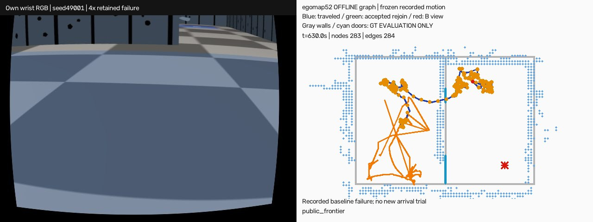

# egomap52 — 자기 지역 정합으로 복구 구간 재연결

## 사전등록 (결과 전)

감독 승인: egomap51의 47성분·B 경로0/4를 복구 양끝/장소 재인식으로 연결한다. 문·벽 검출기·모션·기존 도착 수치 동결. 기존 seed49001–49006 **동일6녹화의 개발 재생**, 확증 자료 아님. 옵션 `return_policy=traversal_graph_reconnect_v1` 기본off; `traversal_graph_v1` 보존. raw는 `/Users/changmin/projects/ugrp/outputs/traversal-reconnection-v1/`. 모델0, 관문 전 물리0, timing 측정0/잠금 미취득, NI=0·NO_BG_NICE.

### 변경하는 조건

- egomap51 .30m/20° 노드와 연속 이동 엣지를 유지. 복구의 직전·직후 노드를 명시적으로 저장하고, 버렸던 중간 자기 추정 자세/관측 ID를 보존한다. 양끝의 정합이 수락될 때만 그 기록된 구간을 엣지로 채택한다. GT 접촉으로 구간을 고르거나 엣지를 제거하지 않는다.
- 정합은 `self_pose_graph.match_loop`와 egomap48 `self_graph_cache.GraphCache`를 **직접 호출**. `GraphOptions()` 전체 불변: ±1m/±15°, .1m/1° 탐색, score≥.55, overlap≥.60(.20m), residual≤.15m, mode gap≥.02, Hessian ratio≥.03, 최소6점, refinement·경계 검사 그대로. 결과/거리장 캐시는 동일 내용 키, 로봇별 격리.
- 복구 양끝은 명시된 연속 구간의 재확인으로 `match_loop`를 호출한다(장기 루프 후보 생성의5초 separation은 적용하지 않음; 수락 수치 변경 없음). 자기 입력에 포함된 같은 scan을 참조-질의 양쪽에 넣지 않는다. 일반 재방문은 기존5초 separation을 유지하고, 기존 노드 간격 .30m 안의 가까운 과거 노드 **k=5**를 후보로 비교한다. k는 계산 예산 사전 선택이며 결과로 바꾸지 않는다. 같은 장소 연결은 matching constraint/출처를 기록하며 거리만으로 연결하지 않는다.
- 지역 submap은 기존 노드의 최근15초/12스캔으로 기존 log-odds inverse model을 재사용. 센서 입출력/좌표계 어댑터 외 새로운 정합·지도 적합0. 수락 연결의 전역 좌표 왜곡은 숨기지 않고 GT 벽 교차 관문에 그대로 포함한다.
- 첫 귀환 정합은 egomap51 **동일 CSM** 수락 규칙에 가장 가까운 k=5 후보를 적용한다. 순서는 거리, node ID. 모두 실패하면 저장 노드의 시야 방향으로 **카메라 v3 반 FOV(27.25°) 이하의 부분 회전1회**, 기존 회복10초 상한; 360° 금지. 귀환 중 다른 노드 정합에도 동일1회 제한. 측면/후진 금지·회전 후 전진·B blacklist 금지는 유지.

### 판정 — egomap51 기준 그대로

1. 6/6 인과적 prefix 생성, 손실 프레임/이후 관측을 그래프에 넣지 않음.
2. B를 관측한 모든 회차(기존4/6)의 마지막 탐색 노드→B 관측 노드 경로 존재.
3. 그 경로의 저장 중간 추정 좌표에 시작 GT 변환만 적용해 중심선 벽 교차0 **및** 기존 footprint0.28×0.24m 겹침0. 실제 GT 경로는 별도 참고. 빈 경로/미관측을 통과로 세지 않음.
4. B 관측+귀환 기록 모든 회차의 **첫 return 프레임**에서 지역 정합 수락 및 B까지 연결.

부분 회전 이후 관측은 첫 프레임 관문에 합산하지 않는다. 녹화는 새 회전 명령을 실제 실행하지 않으므로 단위 시험으로 각도·시간 상한만 검증하고 물리 효과를 주장하지 않는다. prediction·경로를 SHA 봉인한 후에만 별도 GT score. 새 조건 평가1회, 결과 뒤 문턱/설정 변경0. 실패하면 원인·선택지를 기록하고 물리 없이 종료. 모두 통과할 때만 egomap49 동일6seed의 360+270초/dev_light/agent_lock 물리 순차1회씩(다른 잠금은 대기), 도착/6·거짓 선언·벽 접촉·회전 시간비·귀환 시간 비교. ENOSPC=HOST_ERROR, 제외도 전부 표기.

## 참고 자료·기존 코드 대조

- [Kuipers 2000 SSH §4.4/4.6](https://www.cs.cmu.edu/~motionplanning/papers/sbp_papers/k/Kuipers-aij-00-elsevier.pdf): 같은 장소의 다른 표상을 관측/지역 metric 근거로 식별하고, 확인된 위상 연결에서 Dijkstra 경로 선택. 같은 위치 가설과 확인을 구분한다.
- [Hess et al. 2016, Real-Time Loop Closure in 2D LIDAR SLAM](https://research.google/pubs/real-time-loop-closure-in-2d-lidar-slam/), [ConstraintBuilder2D](https://github.com/cartographer-project/cartographer/blob/master/cartographer/mapping/internal/constraints/constraint_builder_2d.cc): 후보 scan-submap 정합과 score 승인, submap matcher 재사용. 기존 Olson 계열 correlative 탐색의 프로젝트 구현 `self_pose_graph.py:137–203`/`self_graph_cache.py:39–81` 직접 사용. 새로운 라이브러리·원문 코드 복사0.
- [egomap48 캐시 동일성](../2026-10-08-graph-runtime/README.md): immutable submap의 field/동일 pair 결과를 내용 해시로 재사용, 장기 graph solver 변경0. 이번에는 속도 측정을 새로 하지 않는다.
- 부분 회전과 k=5는 논문이 우리 카메라에 제시한 최적 수치가 아니다. 후보 탐색·능동 시야 확보 구조만 표준을 따르고, 단안 좁은 FOV의 계산/행동 상한을 위처럼 고정했다. geometry acceptance는 한 값도 재적합하지 않는다.

## egomap51 첫 정합 진단 (이전 봉인 결과, 새 결과 아님)

|seed|최근접 노드 거리 m|노드 heading 차이 절대°|현재/지역조각 선분 수|기존 overlap|기존 사유|
|---|---:|---:|---:|---:|---|
|49001|.016|138.24|7/75|.952|accepted|
|49002|.105|137.42|4/26|0|unobservable|
|49005|.395|100.30|5/79|0|unobservable|
|49006|.234|102.77|1/3|미계산|insufficient_points|

거리 자체는 모두 기존 .5m 범위 안이다. heading 차이만으로 실제 시야 overlap을 단정할 수는 없으나, 실패2건의 정합점 overlap0/Hessian0, 나머지는2끝점이라 최소6점 미달이다. 노드의 과거 여러 시야를 가진 지역 조각 중 다른 후보가 도움이 되는지는 이번 재생으로 판정한다.

## egomap52 결과 — 관문 미달, 물리 미실행

사전등록 `a068cf73`, 구현/설정 동결 `b1a2bc95`. 동일6녹화의 자기 입력 **7,718프레임**을 각1회 재생하고 prediction SHA를 모두 봉인한 뒤 GT 채점했다. 기존6건을 개발에 재사용했으므로 새 확증 아님. 복구 직전 노드40개를 추가해 노드 수1,029→1,069; 따라서 성분 감소만으로 귀환 성공을 주장하지 않는다.

|seed|노드/엣지|성분 eg51→52|복구 연결 수락/시도|재방문 수락/시도|B 성분/종료 성분 노드|B 경로|첫 정합|
|---|---:|---:|---:|---:|---:|---|---|
|49001|283/284|13→10|0/12|14/1163|35/19|없음|수락|
|49002|230/223|8→8|0/7|1/715|27/4|없음|거부: unobservable|
|49003|22/21|1→1|0/0|0/45|B 미관측/22|해당 없음|귀환 전 조기 종료|
|49004|33/29|4→4|0/3|0/63|B 미관측/종료 anchor 없음|해당 없음|귀환 전 조기 종료|
|49005|281/280|12→8|2/11|9/1061|24/19|없음|거부: unobservable|
|49006|220/219|9→7|0/8|8/651|80/2|없음|거부: insufficient_points|
|합계|1069/1056|47→38|2/41|32/3698|B 관측4/6|0/4|1/4|

**eg51 판정4항목 중1항목만 통과**: 인과적 prefix6/6 통과, B 경로0/4·경로 벽 교차0 입증·첫 정합+경로 모두 미달. 경로가 없으므로 경로의 GT 벽 교차는 **미측정**이지 0 성공이 아니다. 도착/6·거짓 선언·물리 접촉·회전 시간·귀환 시간은 이번 조건 물리0으로 미측정; eg49의 실패 주행을 새로운 귀환 실행으로 세지 않는다. 부분 회전의 실제 효과도 미측정.

### 연결 거부와 첫 정합 원인

|정합 결과|복구 양끝(41)|장소 재방문(3698)|
|---|---:|---:|
|수락|2|32|
|ambiguous_modes|17|1524|
|unobservable|15|296|
|low_probability|2|1072|
|search_boundary|1|501|
|refinement_failed|2|49|
|insufficient_points|1|137|
|high_residual|1|73|
|low_overlap|0|14|

복구39거부 중32건(82.1%)은 다중 해석 또는 Hessian 관측성 부족이다. .30m 근접 자체를 연결 근거로 쓰지 않아 통로가 계속 단절된다. egomap48 캐시를 그대로 사용: 3,739쌍을 각각 한 번 정합하고 거리/확률장 field hit3,025회; 동일 pair 재계산0. 잠금이 필요한 시간 벤치마크는 하지 않았다.

|seed|k=5 거리 범위 m|후보 정합 결과|수락 후보 overlap|선택/경로|
|---|---:|---|---:|---|
|49001|.016–.068|수락3·unobservable2|모두 .952|최근접 수락, B 경로 없음|
|49002|.105–.198|unobservable5(overlap0·Hessian0)|없음|변화 없음|
|49005|.395–1.271|unobservable1(overlap0), 기존 .5m 지역 범위 밖4|없음|변화 없음|
|49006|.234–.524|최소점수 미달4, 기존 .5m 범위 밖1|없음|현재 선분1개/끝점2개, 최소6점 미달|

가까운 후보를 늘려도 같은 시야의 기하 정보가 생기지는 않았다. 가까운 위치(첫 후보 .016–.395m)와 큰 heading 차이(100–138°)가 함께 있다. 이 방향 차이만으로 시야 불일치를 단정하지 않고 실제 overlap/Hessian/점수 거부 근거를 병기했다. 49005 후보4개와49006 후보1개는 기존 .5m 지역 정합 범위 밖이므로 탐색 창을 넓히지 않고 거부했다.

수락34제약도 GT 사후 감사에서 상대 XY 오차 중앙 **.312m**, 최대 **.878m**, yaw 중앙4.66°/최대14.46°였다. 복구 수락2개(49005)는 각각 XY .055/.030m, yaw .51/8.81°. 수락=정답이라는 해석은 금지한다. 좌표 수정/전역 재최적화는 이번 범위 밖이며, 원래 추정 좌표와 수락 제약을 함께 저장했다.

|seed|전체 저장 엣지 중심선 벽 교차(추정/구간 수)|GT 실제 중심선 교차|추정 footprint 겹침/표본|GT footprint 겹침/표본|
|---|---:|---:|---:|---:|
|49001|0/1688|0/1688|52/5338|52/4706|
|49002|6/1756|0/1756|75/5026|0/4276|
|49003|0/168|0/168|0/461|3/407|
|49004|0/339|0/339|356/915|0/778|
|49005|31/1771|0/1771|846/5306|306/4703|
|49006|3/1760|0/1760|232/4857|48/4404|

이 표는 **선택된 B 경로가 아닌 전체 엣지 감사**이다. footprint는 기존 여유폭 포함0.28×0.24m이며 겹친 표본을 실제 물리 접촉 횟수로 바꾸지 않는다. 장소 재인식 엣지는 같은 장소라는 가설의 양끝을 잇는 연결이므로, 그 GT 중심선0 또한 실제로 그 직선을 주행했다는 증거가 아니다.

### 검증·산출물

- 변경 모듈 시험26개 통과: `test_own_traversal_reconnection.py`, `test_own_traversal_graph.py`, `test_self_map_return_repeat.py`. 기존 off trace/입자/RNG 바이트 동일, old v1 보존, 직접/캐시 정합 JSON 동일, 복구 실패 미연결·k후보·부분 회전1회/시간상한·prefix 누설 차단 확인.
- 구현 경로: `harness/own_traversal_reconnection.py`의 `observe/_node`:39–82 복구 보존, `pair_match/connect`:84–108 기존 CSM+cache, `match`:114–126 k후보, `PartialReturn`:129–163 부분 회전. `harness/own_traversal_graph.py`에는 새 옵션 dispatch만 추가했다. 외부 라이브러리 추가0, 검출·동작모델·수락 수치 변경0.
- 재현: `code/offline.py predict --seed 49001`(각6건, 기존 prediction 덮어쓰기 금지) → 모든 예측 봉인 → `score --seed ...` → `gate` → `code/diagnose.py`. 원본/예측 해시와 코드 freeze는 `freeze.json`, `results/*.json`, raw의 `seal.json`에 기록.
- 실패 영상: `/Users/changmin/projects/ugrp/outputs/traversal-reconnection-v1/49001/wrist-map-graph-4x.mp4`. eg49의 기존 손목 RGB+자기 지도/경로 위에 eg52 노드·녹색 수락 연결을 덧그린 **오프라인 설명 영상**이다. 새 물리 실패 재실행도 아니며 성공 영상은 성공 사례가 없어 만들지 않았다. 전체 decode 및 첫/중간/마지막 화면 확인, SHA는 `results/video.json`.

### 중단 사유와 선택지 (구현·재튜닝하지 않음)

원인: 같은 시야의 기하 지지가 부족해 복구 연결39/41이 거부되고, 일부 재방문 수락도 큰 상대 자세 오차가 있어 B까지 검증된 연결을 만들지 못했다. 사전 관문을 유지하고 이번 트랙은 여기서 종료한다.

1. **추천:** 복구 직전·직후에 같은 시야가 겹치도록 짧은 부분 관측을 실제로 수집하는 별도 DEV 조건. 현재 녹화로는 새 회전 뒤 영상이 없어 능동 관측 효과를 판정할 수 없다. 새 사전등록/승인 후에만 가능.
2. 현재 벽 선분 대신 이미 저장한 자기 RGB의 시각 장소/상대 자세 정합을 추가하는 teach-and-repeat 확장. 텍스처·조명·역방향 시야에 대한 별도 오프라인 관문이 필요하다.
3. 복구 구간을 끊어진 확정 엣지가 아닌 불확실 이동 엣지로 보존하고 국소 관측으로 검증하는 경험 그래프. 지금의 수락/벽 교차 기준을 통과했다고 간주할 수 없으며 별도 설계·평가가 필요하다.

부분 회전 수치는 명령/추정 yaw 기준 목표 상한이다. 유한 펄스 한 번의 초과 회전 가능성은 남아 있으며 실제 각도 정지 정확도는 이번 물리0에서 검증하지 않았다.
